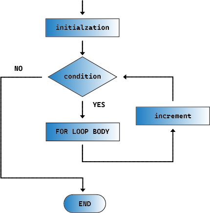

.. note::

    Hello, welcome to the SunFounder Raspberry Pi & Arduino & ESP32 Enthusiasts Community on Facebook! Dive deeper into Raspberry Pi, Arduino, and ESP32 with fellow enthusiasts.

    **Why Join?**

    - **Expert Support**: Solve post-sale issues and technical challenges with help from our community and team.
    - **Learn & Share**: Exchange tips and tutorials to enhance your skills.
    - **Exclusive Previews**: Get early access to new product announcements and sneak peeks.
    - **Special Discounts**: Enjoy exclusive discounts on our newest products.
    - **Festive Promotions and Giveaways**: Take part in giveaways and holiday promotions.

    👉 Ready to explore and create with us? Click [|link_sf_facebook|] and join today!

.. _ar_siren_sound:

12. Siren Sound
=========================

In this Arduino project, we will explore how to create a siren system through programming and the integration of electronic hardware.

Siren sounds use a specific frequency and pitch pattern, characterized by rapid rises and falls in pitch, which is not only easily recognizable but also distinct from other everyday sounds.
These pitch changes can evoke a sense of urgency, as they are often associated with warning signals or dangerous situations in nature.

By adjusting the frequency of a passive buzzer, we can simulate the characteristic rising and falling pitches of a siren sound.

.. raw:: html

    <video controls style = "max-width:90%">
        <source src="../_static/video/12_siren_sound.mp4" type="video/mp4">
        Your browser does not support the video tag.
    </video>

In this lesson, you will learn:

* How passive buzzers work
* How to drive a passive buzzer using the tone() function
* How to use the for loop in programming
* How to implement a siren sound

Understanding Sound Properties
-----------------------------------

Sound is a wave phenomenon that propagates through mediums such as air, water, or solids as vibrating energy. Understanding the physical properties of sound can help us better understand and control how sound behaves in different environments.
Here are several key physical properties of sound:

.. image:: img/7_siren.png
    :width: 500
    :align: center

**Frequency**

Frequency refers to the number of vibration cycles per unit of time, typically expressed in Hertz (Hz).
Frequency determines the pitch of sound: higher frequencies sound higher in pitch; lower frequencies sound lower. The human audible range is approximately from 20 Hz to 20,000 Hz.

**Amplitude**
Amplitude is the strength of the vibration of a sound wave, which determines the loudness of the sound.
Greater amplitude means a louder sound; smaller amplitude means a softer sound.
In physics, amplitude is usually directly related to the energy of a sound wave, while in everyday language, we often use decibels (dB) to describe the loudness of sound.

**Timbre**
Timbre describes the texture or 'color' of sound, which allows us to distinguish sounds from different sources even if they have the same pitch and loudness.
For example, even if a violin and a piano play the same note, we can still distinguish them by their timbre.

In this project, we are only exploring the influence of frequency on sound.

Building the Circuit
-----------------------

**Components Needed**

.. list-table:: 
   :widths: 25 25 25 25
   :header-rows: 0

   * - 1 * Arduino Uno R3
     - 1 * Breadboard
     - 1 * Passive Buzzer
     - Jumper Wires
   * - |list_uno_r3| 
     - |list_breadboard| 
     - |list_passive_buzzer| 
     - |list_wire| 
   * - 1 * USB Cable
     -
     - 
     - 
   * - |list_usb_cable| 
     -
     - 
     - 

**Building Step-by-Step**

In previous lessons, we used active buzzer. In this lesson, we will use a passive buzzer. The circuit is the same, but the coding approach to drive it differs.

1. Locate a passive buzzer, which has an exposed circuit board on its back.

.. image:: img/7_beep_2.png

2. Although there is a '+' sign on the passive buzzer, it is not a polarized device. Insert it in any direction into the 15F and 18F holes of the breadboard.

.. image:: img/16_morse_code_buzzer.png
    :width: 500
    :align: center

3. Connect one pin of the passive buzzer to the GND pin on the Arduino Uno R3.

.. image:: img/16_morse_code_gnd.png
    :width: 500
    :align: center

4. Connect the other pin of the passive buzzer to the 5V pin of the Arduino Uno R3. The buzzer will not make a sound, differentiating it from an active buzzer, which would sound when connected this way.

.. image:: img/16_morse_code_5v.png
    :width: 500
    :align: center

5. Now, remove the wire inserted into the 5V pin and insert it into pin 9 of the Arduino Uno R3, so that the buzzer can be controlled with code.

.. image:: img/16_morse_code.png
    :width: 500
    :align: center

Code Creation - Make the Passive Buzzer Sound
---------------------------------------------------

As we learned while connecting, simply providing high and low power to a passive buzzer won't make it sound. In Arduino programming, the ``tone()`` function is used to control a passive buzzer or other audio output devices to generate a sound at a specified frequency.

    * ``tone()``: Generates a square wave of the specified frequency (and 50% duty cycle) on a pin. A duration can be specified, otherwise the wave continues until a call to ``noTone()``.

    **Syntax**

        * ``tone(pin, frequency)``
        * ``tone(pin, frequency, duration)``

    **Parameters**

        * ``pin``: the Arduino pin on which to generate the tone.
        * ``frequency``: the frequency of the tone in hertz. Allowed data types: unsigned int.
        * ``duration``: the duration of the tone in milliseconds (optional). Allowed data types: unsigned long.

    **Returns**
        Nothing

1. Open the Arduino IDE and start a new project by selecting “New Sketch” from the “File” menu.
2. Save your sketch as ``Lesson12_Tone`` using ``Ctrl + S`` or by clicking “Save”.

3. First, define the buzzer pin.

.. code-block:: Arduino

    const int buzzerPin = 9;  // Assigns the pin 9 to the constant for the buzzer

    void setup() {
        // put your setup code here, to run once:
    }

4. To fully understand the use of the ``tone()`` function, we write it in the ``void setup()`` so that the buzzer will emit a sound at a specific frequency for a set duration.

.. code-block:: Arduino
    :emphasize-lines: 5

    const int buzzerPin = 9;  // Assigns the pin 9 to the constant for the buzzer

    void setup() {
        // put your setup code here, to run once:
        tone(buzzerPin, 1000, 100);  // Turn on the buzzer at 1000 Hz with a duration of 100 milliseconds
    }

    void loop() {
        // put your main code here, to run repeatedly:
    }

5. Now you can upload the code to the Arduino Uno R3, after which you will hear a brief "beep" sound from the passive buzzer, and then it will go silent.

**Questions**

1. If you switch the code and circuit pins to 7 or 8, which are not PWM pins, will the buzzer still make a sound? You can test and then write your answer in the handbook.

2. To explore how ``frequency`` and ``duration`` in ``tone(pin, frequency, duration)`` affect the sound of the buzzer, please modify the code under two conditions and fill in the observed phenomena in your handbook:

* Keeping ``frequency`` at 1000, gradually increase ``duration``, from 100, 500, to 1000. How does the sound of the buzzer change, and why?

* Keeping ``duration`` at 100, gradually increase ``frequency``, from 1000, 2000, to 5000. How does the sound of the buzzer change, and why?

Code Creation - Emit a Siren Sound
-----------------------------------------

Previously, we learned how to make a buzzer emit sound and understood how frequency and duration affect the sound. Now, if we want to make the buzzer emit a siren sound that increases from a low to a high pitch, how should we proceed?

From our earlier explorations, we know that using the ``tone(pin, frequency)`` function allows a passive buzzer to emit sound. Gradually increasing the ``frequency`` makes the pitch of the passive buzzer's sound higher. Let's implement this with code now.

1. Open the sketch you saved earlier, ``Lesson12_Tone``. Hit “Save As...” from the “File” menu, and rename it to ``Lesson12_Siren_Sound``. Click "Save".

2. Write the ``tone()`` function into the ``void loop()`` and set three different frequencies. To clearly hear the difference in each frequency sound, use the ``delay()`` function to separate them.

.. code-block:: Arduino

    const int buzzerPin = 9;  // Assigns the pin 9 to the constant for the buzzer

    void setup() {
        // put your setup code here, to run once:
    }

    void loop() {
        // put your main code here, to run repeatedly:
        tone(buzzerPin, 100);  // Turn on the buzzer at 100 Hz
        delay(500);
        tone(buzzerPin, 300);  // Turn on the buzzer at 300 Hz
        delay(500);
        tone(buzzerPin, 600);  // Turn on the buzzer at 600 Hz
        delay(500);
    }

3. At this point, you can upload the code to the Arduino Uno R3, and you will hear the buzzer repeating three different tones.

4. To achieve a smoother pitch increase, we should set shorter intervals for ``frequency``, such as an interval of 10, starting from 100, 110, 120...up to 1000. We can write the following code.

.. code-block:: Arduino

    void loop() {
        // put your main code here, to run repeatedly:
        tone(buzzerPin, 100);  // Turn on the buzzer at 1000 Hz
        delay(500);
        tone(buzzerPin, 110);  // Turn on the buzzer at 1000 Hz
        delay(500);
        tone(buzzerPin, 120);  // Turn on the buzzer at 1000 Hz
        delay(500);
        tone(buzzerPin, 130);  // Turn on the buzzer at 1000 Hz
        delay(500);
        tone(buzzerPin, 140);  // Turn on the buzzer at 1000 Hz
        delay(500);
        tone(buzzerPin, 150);  // Turn on the buzzer at 1000 Hz
        delay(500);
        tone(buzzerPin, 160);  // Turn on the buzzer at 1000 Hz
        delay(500);
        ...
    }

5. You will notice that if you really wanted to write up to 1000, this code would be over two hundred lines long. At this point, you can use the ``for`` statement, which is used to repeat a block of statements enclosed in curly braces.

    * ``for``: The ``for`` statement is useful for any repetitive operation, and is often used in combination with arrays to operate on collections of data/pins. An increment counter is usually used to increment and terminate the loop. 

    **Syntax**

    .. code-block::

        for (initialization; condition; increment) {
            // statement(s);
        }

    **Parameters**

        * ``initialization``: happens first and exactly once.
        * ``condition``: each time through the loop, condition is tested; if it's true, the statement block and the increment are executed, then the condition is tested again. When the condition becomes false, the loop ends.
        * ``increment``: executed each time through the loop when condition is true.

6. Now change the ``void loop()`` function as shown below, where ``freq`` starts at 100 and increases by 10 until 1000.

.. code-block:: Arduino
    :emphasize-lines: 3-6

    void loop() {
        // Gradually increase the pitch
        for (int freq = 100; freq <= 1000; freq += 10) {
            tone(buzzerPin, freq);  // Emit a tone
            delay(20);              // Wait before changing the frequency
        }
    }

7. Next, let ``freq`` start at 1000 and decrease by 10 until 100, so you can hear the buzzer's sound go from low to high and then from high to low, thus simulating a siren sound.

.. code-block:: Arduino
    :emphasize-lines: 9-12

    void loop() {
        // Gradually increase the pitch
        for (int freq = 100; freq <= 1000; freq += 10) {
            tone(buzzerPin, freq);  // Emit a tone
            delay(20);              // Wait before changing the frequency
        }

        // Gradually decrease the pitch
        for (int freq = 1000; freq >= 100; freq -= 10) {
            tone(buzzerPin, freq);  // Emit a tone
            delay(20);              // Wait before changing the frequency
        }
    }

8. Here is your complete code. You can now click "Upload" to upload the code to the Arduino Uno R3.

.. code-block:: Arduino

    const int buzzerPin = 9;  // Assigns the pin 9 to the constant for the buzzer

    void setup() {
        // put your setup code here, to run once:
    }

    void loop() {
        // Gradually increase the pitch
        for (int freq = 100; freq <= 1000; freq += 10) {
            tone(buzzerPin, freq);  // Emit a tone
            delay(20);              // Wait before changing the frequency
        }

        // Gradually decrease the pitch
        for (int freq = 1000; freq >= 100; freq -= 10) {
            tone(buzzerPin, freq);  // Emit a tone
            delay(20);              // Wait before changing the frequency
        }
    }

9. Finally, remember to save your code and tidy up your workspace.

**Summary**

In this lesson, we explored how to use an Arduino and a passive buzzer to simulate a siren sound. By discussing the basic physical properties of sound, such as frequency and pitch, we learned how these elements influence the perception and effect of sound. Through hands-on activities, we not only learned how to build circuits but also mastered programming with the ``tone()`` function on Arduino to control the frequency and duration of sound, achieving the simulation of a siren sound that rises and falls in pitch.
