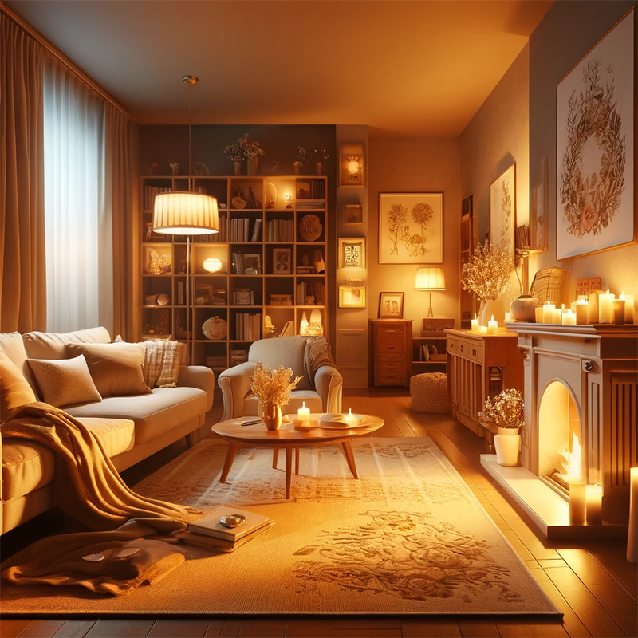
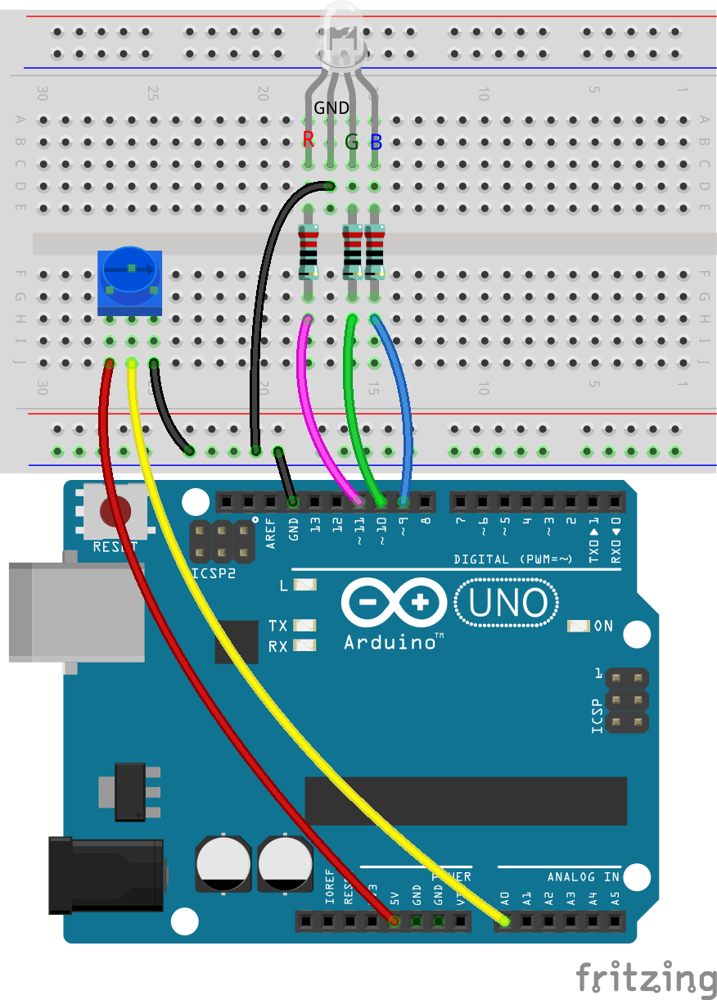
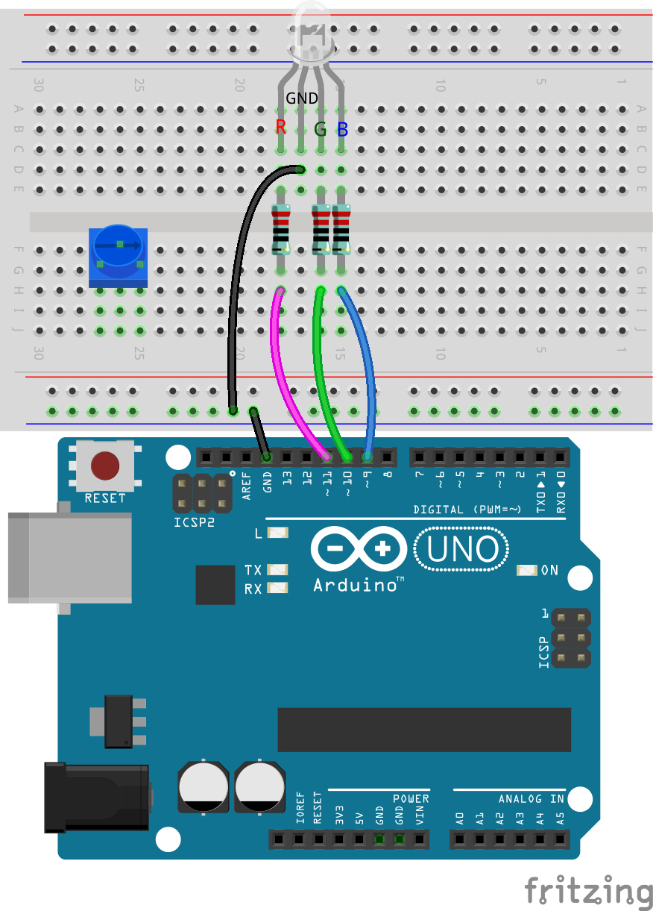
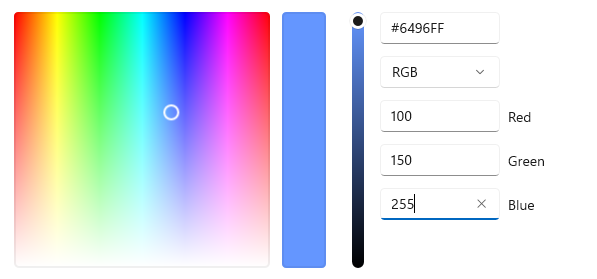

.. note::

    Hello, welcome to the SunFounder Raspberry Pi & Arduino & ESP32 Enthusiasts Community on Facebook! Dive deeper into Raspberry Pi, Arduino, and ESP32 with fellow enthusiasts.

    **Why Join?**

    - **Expert Support**: Solve post-sale issues and technical challenges with help from our community and team.
    - **Learn & Share**: Exchange tips and tutorials to enhance your skills.
    - **Exclusive Previews**: Get early access to new product announcements and sneak peeks.
    - **Special Discounts**: Enjoy exclusive discounts on our newest products.
    - **Festive Promotions and Giveaways**: Take part in giveaways and holiday promotions.

    👉 Ready to explore and create with us? Click [|link_sf_facebook|] and join today!

15. Cool or Warm Colors
=========================

Colors are not just a part of our visual experience—they also influence our emotions and feelings. In this lesson, we dive into the psychological impacts of colors and learn how to manipulate an RGB LED to shift between warm and cool colors, mimicking the effects of changing light temperatures.

.. raw:: html

    <video muted controls style = "max-width:90%">
        <source src="../_static/video/15_cool_warm_color.mp4" type="video/mp4">
        Your browser does not support the video tag.
    </video>

**Overview**

The concept of cool and warm colors relates to the psychological effects colors have on our perception. Reds, oranges, yellows, and browns typically evoke feelings of warmth and excitement, classifying them as warm colors. Conversely, greens, blues, and purples often impart calming, refreshing, and spacious feelings, making them cool colors. Orange and blue are at opposite ends of this warm-cool spectrum.

.. image:: img/15_mix_color_warm_cool.png
    :width: 400
    :align: center

At home or in leisure environments, people prefer lighting in shades of light yellow or off-white, creating a cozy atmosphere akin to being bathed in sunset or candlelight.

In libraries, classrooms, offices, and hospitals, cooler lighting tones are favored as they promote concentration and freshness, which are conducive to working and learning.

The warmth or coolness of light is a visceral experience that affects our psychological response and visual comfort. Designers and lighting engineers carefully select color temperatures suited to a space's function and desired ambiance, creating both aesthetically pleasing and practical lighting environments. By scientifically applying these principles, we can enhance the quality of our living and working environments, fostering a healthier and more comfortable atmosphere.

In this lesson, we'll take on the role of lighting engineers to create a lighting system that can switch between color temperatures.

**Learning Objectives**

- Understand the psychological effects of cool and warm colors.
- Explore how light temperatures affect mood and setting.
- Learn to adjust RGB LED colors to simulate different temperatures using Arduino.
- Develop practical skills in using the ``map()`` function to transition between color temperatures.

Build the Circuit
------------------------------------

**Components Needed**

.. list-table:: 
   :widths: 25 25 25 25
   :header-rows: 0

   * - 1 * Arduino Uno R3
     - 1 * RGB LED
     - 3 * 220Ω Resistor
     - 1 * Potentiometer
   * - |list_uno_r3| 
     - |list_rgb_led| 
     - |list_220ohm| 
     - |list_potentiometer| 
   * - 1 * USB Cable
     - 1 * Breadboard
     - Jumper Wires
     -
   * - |list_usb_cable| 
     - |list_breadboard| 
     - |list_wire| 
     -
     
**Building Steps**

This circuit builds upon the one from Lesson 12 by adding a potentiometer.

1. Remove the jumper wire connecting the GND pin of the Arduino Uno R3 to the GND pin of the RGB LED and then insert it into the negative terminal of the breadboard. Then, connect a jumper wire from the negative terminal to the GND pin of the RGB LED.

.. image:: img/15_cool_warm_color_gnd.png
    :width: 500
    :align: center

2. Insert the potentiometer into holes 25G, 26F, and 27G.

3. Connect the middle pin of the potentiometer to the A0 pin of the Arduino Uno R3.

.. image:: img/15_cool_warm_color_a0.png
    :width: 500
    :align: center

4. Finally, connect the left pin of the potentiometer to the 5V pin on the Arduino Uno R3 and the right pin to the negative terminal on the breadboard.

Code Creation
---------------------

**Understanding Warm and Cool Colors**

Before adjusting the color temperature, we need to understand the differences between the RGB values for cool and warm colors.

The perception of warmth in lighting is somewhat subjective, but unquestionably, warm colors should lean towards orange-red, while cool colors should lean towards blue.

1. Open **Paint** or any color picking tool, find what you consider the warmest and coolest colors, and record their RGB values in your handbook.

.. note::

    Note that before you select a color, adjust the lumens to the proper position.

.. list-table::
   :widths: 25 25 50 25
   :header-rows: 1

   * - Color Type
     - Red
     - Green
     - Blue
   * - Warm Color
     -
     -
     -
   * - Cool Color
     -
     -
     -

2. Here are examples of warm and cool tones along with their RGB values:

* Red (Red: 246, Green: 52, Blue: 8)

.. image:: img/15_mix_color_tone_warm.png

* Light Blue (Red: 100 ,Green: 150, Blue: 255)

The primary difference between warm and cool colors is the ratio of the three primary color intensities. Next, we'll store these warm and cool RGB values in our sketch.

3. Open the sketch you saved earlier, ``Lesson11_PWM_Color_Mixing``. Hit “Save As...” from the “File” menu, and rename it to ``Lesson15_Cool_Warm_Color``. Click "Save".

4. Before the ``void setup()``, declare six variables to store the RGB values for these two colors. Use the colors you've selected.

.. code-block:: Arduino
    :emphasize-lines: 1-4,6-9

    // RGB values for a warm color
    int warm_r = 246;
    int warm_g = 52;
    int warm_b = 8;

    // RGB values for a cool color
    int cool_r = 100;
    int cool_g = 150;
    int cool_b = 255;

    void setup() {
        // put your setup code here, to run once:
        pinMode(9, OUTPUT);   // Set Blue pin of RGB LED as output
        pinMode(10, OUTPUT);  // Set Green pin of RGB LED as output
        pinMode(11, OUTPUT);  // Set Red pin of RGB LED as output
    }

**Using the map() Function**

To transition from warm to cool lighting, all you need to do is reduce the intensity of red light, increase blue light, and finely adjust green light intensity.

In previous projects, we've learned how to vary the LED's brightness in response to the rotation of a potentiometer.

However, in this project, the potentiometer's rotation causes the intensities of the RGB pins to change within a specific range, making simple division inadequate for our needs. Thus, we require a new function, ``map()``.

In Arduino programming, the ``map()`` function is extremely useful because it allows you to map (or convert) a numerical range to another range.

Here is how to use it:

* ``map(value, fromLow, fromHigh, toLow, toHigh)``: Re-maps a number from one range to another. That is, a value of ``fromLow`` would get mapped to ``toLow``, a value of ``fromHigh`` to ``toHigh``, values in-between to values in-between, etc.

    **Parameters**
        * ``value``: the number to map.
        * ``fromLow``: the lower bound of the value's current range.
        * ``fromHigh``: the upper bound of the value's current range.
        * ``toLow``: the lower bound of the value's target range.
        * ``toHigh``: the upper bound of the value's target range.

    **Returns**
        The mapped value. Data type: long.

The ``map()`` function scales a value from its original range (fromLow to fromHigh) to a new range (toLow to toHigh). First, it calculates the position of the ``value`` within its original range, then applies the same proportion to scale this position to the new range.

.. image:: img/15_map_pic.png
    :width: 400
    :align: center

So it can be written as the formula shown below:

.. code-block::

    (value-fromLow)/(fromHigh-fromLow) = (y-toLow)/(toHigh-toLow)

Using algebra, you can rearrange this equation to solve for ``y``:

.. code-block::

    y = (value-fromLow) * (toHigh-toLow) / (fromHigh-fromLow) + toLow

For instance, using ``y = map(value, 0, 1023, 246, 100);``, if ``value`` equals 434, then ``y = (434-0) * (100 - 246) / (1023-0) + 246``, which approximately equals 152.

5. Remove the original code in ``void loop()``, then write code to read the potentiometer value, storing it in the variable ``potValue``.

.. code-block:: Arduino

    void loop() {
        // put your main code here, to run repeatedly:
        int potValue = analogRead(A0);                         // Read value from potentiometer
    }

6. Then, use the ``map()`` function to map the potentiometer value from the range 0~1023 to the range 255 (``warm_r``) ~ 100 (``cool_r``).

.. code-block:: Arduino

    void loop() {
        // put your main code here, to run repeatedly:
        int potValue = analogRead(A0);                         // Read value from potentiometer
        int value_r = map(potValue, 0, 1023, warm_r, cool_r);  // Map pot value to red intensity
    }

7. You can use the serial monitor to view the ``potValue`` and the mapped value ``value_r`` to deepen your understanding of the ``map()`` function. Now start the serial monitor in ``void setup()``.

.. code-block:: Arduino
    :emphasize-lines: 6

    void setup() {
        // put your setup code here, to run once:
        pinMode(9, OUTPUT);   // Set Blue pin of RGB LED as output
        pinMode(10, OUTPUT);  // Set Green pin of RGB LED as output
        pinMode(11, OUTPUT);  // Set Red pin of RGB LED as output
        Serial.begin(9600);        // Serial communication setup at 9600 baud
    }

8. Print the variables ``potValue`` and ``value_r`` on the same line, separated by "|".

.. code-block:: Arduino
    :emphasize-lines: 23-26

    // RGB values for a warm color
    int warm_r = 246;
    int warm_g = 52;
    int warm_b = 8;

    // RGB values for a cool color
    int cool_r = 100;
    int cool_g = 150;
    int cool_b = 255;

    void setup() {
        // put your setup code here, to run once:
        pinMode(9, OUTPUT);   // Set Blue pin of RGB LED as output
        pinMode(10, OUTPUT);  // Set Green pin of RGB LED as output
        pinMode(11, OUTPUT);  // Set Red pin of RGB LED as output
        Serial.begin(9600);        // Serial communication setup at 9600 baud
    }

    void loop() {
        // put your main code here, to run repeatedly:
        int potValue = analogRead(A0);                         // Read value from potentiometer
        int value_r = map(potValue, 0, 1023, warm_r, cool_r);  // Map pot value to red intensity
        Serial.print(potValue);
        Serial.print(" | ");
        Serial.println(value_r);
        delay(500);  // Wait for 500ms
    }

    // Function to set the color of the RGB LED
    void setColor(int red, int green, int blue) {
        analogWrite(11, red);    // Write PWM to red pin
        analogWrite(10, green);  // Write PWM to green pin
        analogWrite(9, blue);    // Write PWM to blue pin
    }

9. You can now verify and upload your code, open the serial monitor, and you will see two columns of data printed.

.. code-block::

    434 | 152
    435 | 152
    434 | 152
    434 | 152
    434 | 152
    434 | 152

From the data, it is evident that the value 434's position within the range 0~1023 corresponds to the position of 152 within the range 246~100.

**Adjusting Color Temperature**

Here we use the ``map()`` function to make the intensity of the three pins of the RGB LED change with the rotation of the potentiometer, shifting from the warmest to the coldest hues.
More specifically, as an example with the reference values I provided, as the potentiometer is rotated,
the R value of the RGB LED will gradually change from 246 to 100, G value from 8 to 150 (even though the change in G value is not very noticeable), and B value gradually from 8 to 255.

10. Next, we won't need serial printing temporarily, and serial printing can affect the entire code process, so use ``Ctrl +/`` to comment out the related code.

    .. note::

        The reason not to delete directly is that if you need to print below, you do not need to rewrite it; just select these lines and press ``Ctrl+/`` to uncomments.

.. code-block:: Arduino
    :emphasize-lines: 3,4

    void loop() {
        // put your main code here, to run repeatedly:
        int potValue = analogRead(A0);                         // Read value from potentiometer
        int value_r = map(potValue, 0, 1023, warm_r, cool_r);  // Map pot value to red intensity
        // Serial.print(potValue);
        // Serial.print(" | ");
        // Serial.println(value_r);
        // delay(500);  // Wait for 500ms
    }

11. Continue to call the ``map()`` function, to get the mapped ``value_g`` and ``value_b`` based on the potentiometer's value.

.. code-block:: Arduino
    :emphasize-lines: 9,10

    void loop() {
        // put your main code here, to run repeatedly:
        int potValue = analogRead(A0);                         // Read value from potentiometer
        int value_r = map(potValue, 0, 1023, warm_r, cool_r);  // Map pot value to red intensity
        // Serial.print(potValue);
        // Serial.print(" | ");
        // Serial.println(value_r);
        // delay(500);  // Wait for 500ms
        int value_g = map(potValue, 0, 1023, warm_g, cool_g);  // Map pot value to green intensity
        int value_b = map(potValue, 0, 1023, warm_b, cool_b);  // Map pot value to blue intensity
    }

12. Finally, call the ``setColor()`` function to display the mapped RGB values on the RGB LED.

.. code-block:: Arduino
    :emphasize-lines: 11,12

    void loop() {
        // put your main code here, to run repeatedly:
        int potValue = analogRead(A0);                         // Read value from potentiometer
        int value_r = map(potValue, 0, 1023, warm_r, cool_r);  // Map pot value to red intensity
        // Serial.print(potValue);
        // Serial.print(" | ");
        // Serial.println(value_r);
        // delay(500);  // Wait for 500ms
        int value_g = map(potValue, 0, 1023, warm_g, cool_g);  // Map pot value to green intensity
        int value_b = map(potValue, 0, 1023, warm_b, cool_b);  // Map pot value to blue intensity
        setColor(value_r, value_g, value_b);                   // Set LED color
        delay(500);
    }

13. Your complete code is as follows; you can click the Upload button to upload the code to the Arduino Uno R3. Then you can rotate the potentiometer, and you will notice the RGB LED slowly transition from a cool to a warm hue, or from a warm hue to a cool hue.

.. code-block:: Arduino

    // RGB values for a warm color
    int warm_r = 246;
    int warm_g = 52;
    int warm_b = 8;

    // RGB values for a cool color
    int cool_r = 100;
    int cool_g = 150;
    int cool_b = 255;

    void setup() {
        // put your setup code here, to run once:
        pinMode(9, OUTPUT);   // Set Blue pin of RGB LED as output
        pinMode(10, OUTPUT);  // Set Green pin of RGB LED as output
        pinMode(11, OUTPUT);  // Set Red pin of RGB LED as output
    }

    void loop() {
        // put your main code here, to run repeatedly:
        int potValue = analogRead(A0);                         // Read value from potentiometer
        int value_r = map(potValue, 0, 1023, warm_r, cool_r);  // Map pot value to red intensity
        // Serial.print(potValue);
        // Serial.print(" | ");
        // Serial.println(value_r);
        // delay(500);  // Wait for 500ms
        int value_g = map(potValue, 0, 1023, warm_g, cool_g);  // Map pot value to green intensity
        int value_b = map(potValue, 0, 1023, warm_b, cool_b);  // Map pot value to blue intensity
        setColor(value_r, value_g, value_b);                   // Set LED color
        delay(500);                                            // Wait for 500ms
    }

    // Function to set the color of the RGB LED
    void setColor(int red, int green, int blue) {
        analogWrite(11, red);    // Write PWM to red pin
        analogWrite(10, green);  // Write PWM to green pin
        analogWrite(9, blue);    // Write PWM to blue pin
    }

14. Finally, remember to save your code and tidy up your workspace.

**Tips**

During the experiment, you might find that the shift between warm and cool hues is not as apparent as seen on screen; for example, an expected warm light may appear white. This is normal, as the color mixing in an RGB LED is not as refined as on a display.

In such cases, you can reduce the intensity of G and B values in the warm color to make the RGB LED display a more appropriate color.

**Question**

Note that the "lower bounds" of either range may be larger or smaller than the "upper bounds", so the ``map(value, fromLow, fromHigh, toLow, toHigh)`` function may be used to reverse a range of numbers, for example:

.. code-block::

    y = map(x, 1, 50, 50, 1);

The function also handles negative numbers well, so that this example is also valid and works well.

.. code-block::

    y = map(x, 1, 50, 50, -100);

For ``y = map(x, 1, 50, 50, -100);``, if ``x`` equals 20, what should ``y`` be? Refer to the following formula to calculate it.

