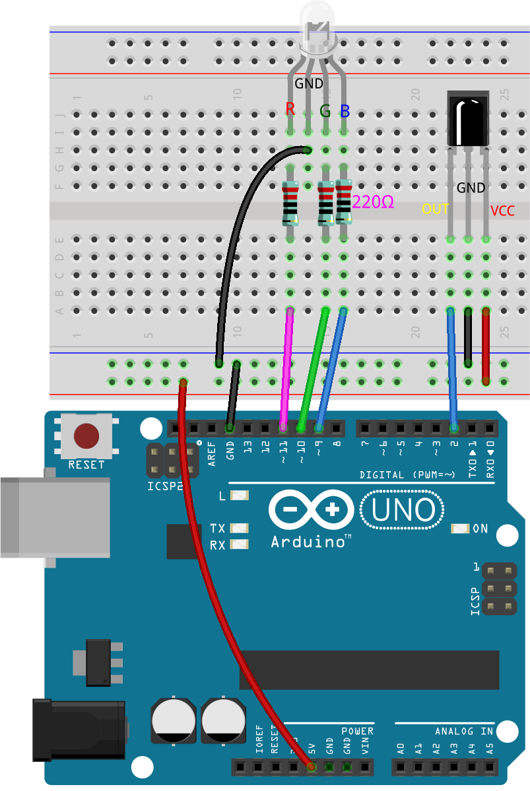
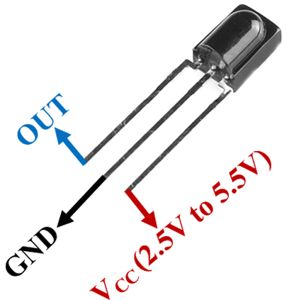
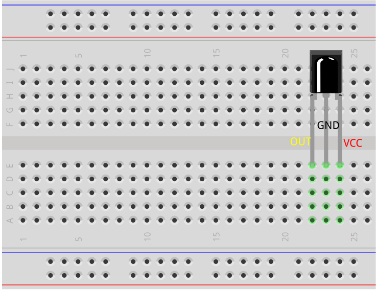
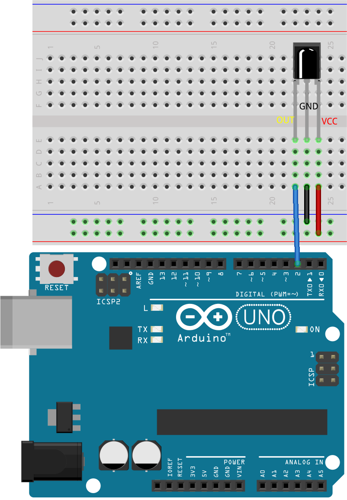
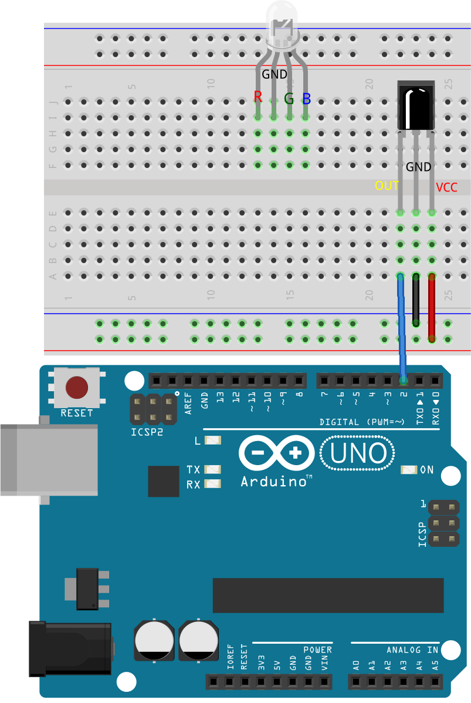
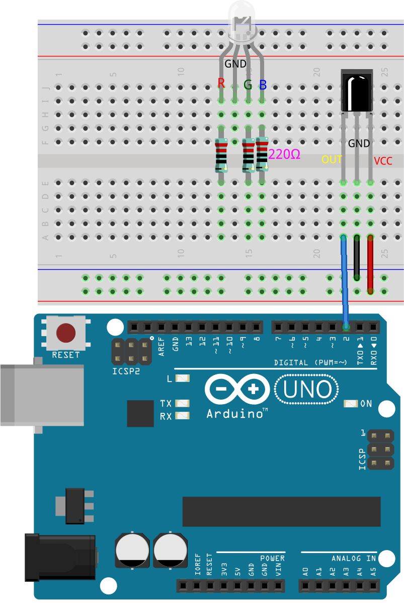
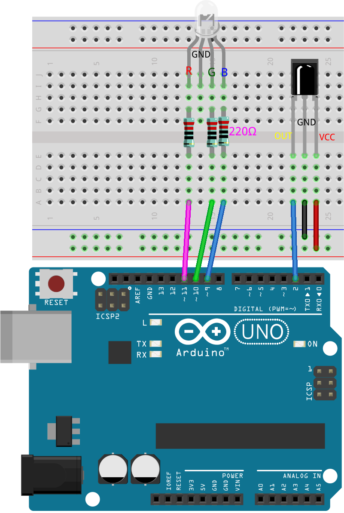
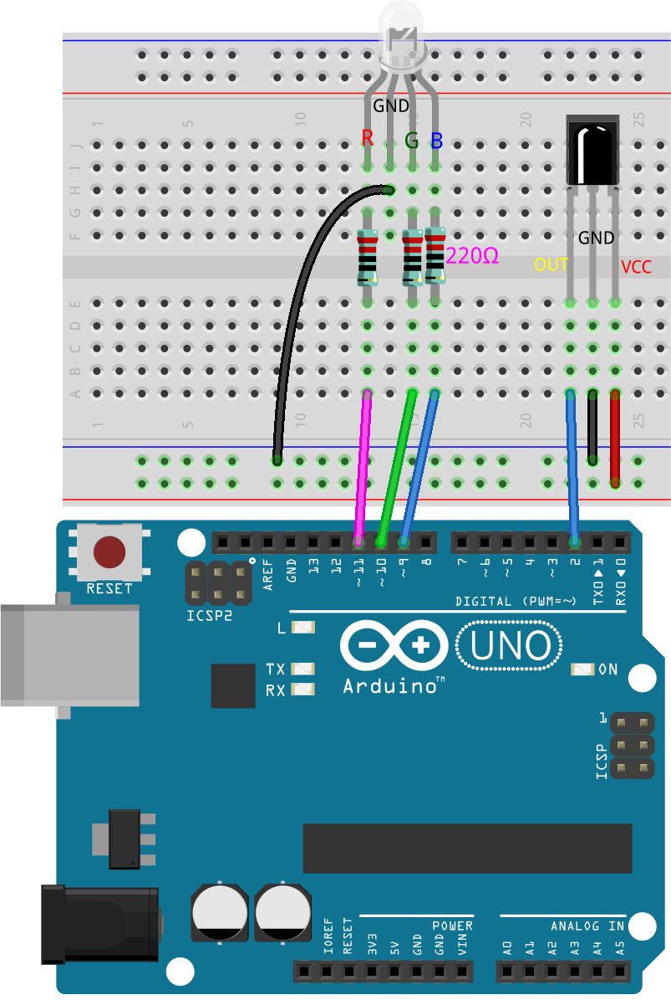
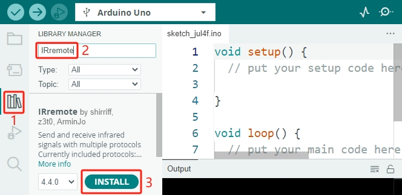

.. note::

    Hello, welcome to the SunFounder Raspberry Pi & Arduino & ESP32 Enthusiasts Community on Facebook! Dive deeper into Raspberry Pi, Arduino, and ESP32 with fellow enthusiasts.

    **Why Join?**

    - **Expert Support**: Solve post-sale issues and technical challenges with help from our community and team.
    - **Learn & Share**: Exchange tips and tutorials to enhance your skills.
    - **Exclusive Previews**: Get early access to new product announcements and sneak peeks.
    - **Special Discounts**: Enjoy exclusive discounts on our newest products.
    - **Festive Promotions and Giveaways**: Take part in giveaways and holiday promotions.

    👉 Ready to explore and create with us? Click [|link_sf_facebook|] and join today!

.. _ar_ir_receiver:

22. Remote-Controlled Colorful Light
===================================================

As Christmas approaches, many people decorate their homes with colorful lights. Imagine creating your own remote-controlled colorful light setup! In this lesson, we'll use an Arduino, an infrared receiver, and an RGB LED to make a festive, programmable light display.

.. raw:: html

    <video muted controls style = "max-width:90%">
        <source src="../_static/video/22_ir_rgb_led.mp4" type="video/mp4">
        Your browser does not support the video tag.
    </video>

By the end of this lesson, you will be able to:

* Understand how an infrared receiver works.
* Decode infrared signals from a remote control.
* Control an RGB LED using decoded signals to display various colors and effects.

Building the Circuit
-----------------------

**Components Needed**

.. list-table:: 
   :widths: 25 25 25 25
   :header-rows: 0

   * - 1 * Arduino Uno R3
     - 1 * RGB LED
     - 3 * 220Ω Resistor
     - 1 * IR Receiver
   * - |list_uno_r3| 
     - |list_rgb_led| 
     - |list_220ohm| 
     - |list_receiver| 
   * - 1 * Remote Control
     - 1 * Breadboard
     - Jumper Wires
     - 1 * USB Cable
   * - |list_remote| 
     - |list_breadboard| 
     - |list_wire| 
     - |list_usb_cable| 

**Building Step-by-Step**

Follow the wiring diagram, or the steps below to build your circuit.

1. Find the infrared receiver.

* **OUT**: Signal output
* **GND**: Ground
* **VCC**: Power supply, 2.5V~5V

The SL838 infrared receiver is a component that receives infrared signals and can independently receive infrared rays and output signals compatible with TTL level. It is similar in size to a normal plastic-packaged transistor and is suitable for all kinds of infrared remote control and infrared transmission.

Infrared (IR) communication is a popular, low-cost, and easy-to-use wireless communication technology. Infrared light has a slightly longer wavelength than visible light, making it imperceptible to the human eye—ideal for wireless communication. A common modulation scheme for infrared communication is 38KHz modulation.

2. The infrared receiver is paired with a 21-key remote control.

.. image:: img/22_receiver_remote_control.jpeg
  :width: 400
  :align: center

This sleek remote features 21 keys for various functions, boasting an effective transmission distance of up to 8 meters. Its compact dimensions (85x39x6mm) make it ideal for small hands, while the 3V key-type lithium manganese battery ensures long-lasting performance. Operating at an infrared carrier frequency of 38KHz and wrapped in a durable 0.125mm PET surface, this remote is built to withstand over 20,000 uses, making it a reliable choice for controlling a wide range of devices.

3. Insert the infrared receiver into the breadboard. The infrared receiver has a front and back side, with the protruding side being the front. The pin order from left to right is OUT, GND, and VCC.

4. Connect the OUT pin of the infrared receiver to pin 2 on the Arduino Uno R3, GND to the negative rail of the breadboard, and VCC to the positive rail of the breadboard.

5. Insert the RGB LED into the breadboard with its longest pin positioned in the second pin from the left.

6. Insert a 220-ohm resistor in the same row as the R, G, and B pins.

7. Connect these resistors to pins 9, 10, and 11 on the Arduino Uno R3 with jumper wires as illustrated.

8. Connect the longest pin of the RGB LED to the breadboard's negative rail using a jumper wire.

9. Finally, connect the GND and 5V pins of the Arduino Uno R3 to the negative and positive rails of the breadboard, respectively.

Code Creation - Getting the Key Values
---------------------------------------------

Here, we will learn how the infrared receiver works and how it recognizes different key values from the infrared remote control.

1. Open the Arduino IDE and start a new project by selecting “New Sketch” from the “File” menu.
2. Save your sketch as ``Lesson22_Get_Key_Value`` using ``Ctrl + S`` or by clicking “Save”.

3. Like the I2C LCD1602, the Arduino IDE does not come with a built-in library for the infrared receiver. You need to manually download it from the Library Manager. Now, search for ``IRremote`` in the **Library Manager**, then click **INSTALL**.

4. Now, let's start coding. Before using each library, it is essential to include it in your sketch. Then, define the infrared receiver pin.

.. code-block:: Arduino
  :emphasize-lines: 1,3

  #include <IRremote.h>

  const int receiverPin = 2;  // Define the pin number for the IR Sensor

  void setup() {
    // put your setup code here, to run once:

  }

5. In the ``void setup()`` function, initialize serial communication at 9600 bps and initialize the IR receiver on the specified pin with LED feedback enabled.

* The specified pin usually refers to the built-in LED on pin 13 of the Arduino board. Every time you press a key on the remote towards the infrared receiver, the LED on pin 13 of the Arduino board will flash quickly once, indicating that an IR signal has been received.

.. code-block:: Arduino
  :emphasize-lines: 3,5

  void setup() {
    // Start serial communication at a baud rate of 9600
    Serial.begin(9600);
    // Initialize the IR receiver on the specified pin with LED feedback enabled
    IrReceiver.begin(receiverPin, ENABLE_LED_FEEDBACK);
  }

6. In the ``loop()`` function, first use the ``IrReceiver.decode()`` function to check if the infrared receiver has received a signal. If a signal is received, it will return true.

.. code-block:: Arduino
  :emphasize-lines: 2

  void loop() {
    if (IrReceiver.decode()) {                                // Check if the IR receiver has received a signal

    }
  }

7. Next, print the received key value to the Serial Monitor. The ``Serial.println()`` function outputs numbers in decimal format by default. To get the hexadecimal key value, set the format to ``HEX``.

.. code-block:: Arduino
  :emphasize-lines: 3-5

  void loop() {
    if (IrReceiver.decode()) {                                // Check if the IR receiver has received a signal
      Serial.print("0x");                                     // print the "0x"
      Serial.println(IrReceiver.decodedIRData.command, HEX);  // Print the command from the decoded IR data
      delay(100);
      IrReceiver.resume();                                    // Prepare the IR receiver to receive the next signal
    }
  }

8. Here is your complete code. You can upload it to the Arduino Uno R3.

.. code-block:: Arduino

  #include <IRremote.h>  // Include the IRremote library

  const int receiverPin = 2;  // Define the pin number for the IR Sensor

  void setup() {
    // Start serial communication at a baud rate of 9600
    Serial.begin(9600);                                  
    // Initialize the IR receiver on the specified pin with LED feedback enabled
    IrReceiver.begin(receiverPin, ENABLE_LED_FEEDBACK);  
  }

  void loop() {
    if (IrReceiver.decode()) {                                // Check if the IR receiver has received a signal
      Serial.print("0x");                                     // print the "0x"
      Serial.println(IrReceiver.decodedIRData.command, HEX);  // Print the command from the decoded IR data
      delay(100);
      IrReceiver.resume();                                    // Prepare the IR receiver to receive the next signal
    }
  }

9. After uploading the code, you can try pressing different keys. You will see the hexadecimal key values being printed to the Serial Monitor.

.. note::

  * Before pressing the keys, you need to remove the plastic tab at the back of the remote to power it.
  * You may notice that most key values are printed two or three times. This happens because the keys can bounce, so even though it feels like you pressed the key once, the Arduino might detect multiple presses.

.. code-block::

  0x45
  0x45
  0x43
  0x43
  0x7
  0x7

**Questions**

1. Please carefully press each key on the remote control and record the corresponding key values in the table in your manual.

.. image:: img/22_receiver_remote_control.jpeg
  :width: 400
  :align: center

.. list-table::
   :widths: 20 20 20 20
   :header-rows: 1

   * - Key Name
     - Key Value
     - Key Name
     - Key Value
   * - POWER
     - *0x45*
     - 0
     - *0x16*
   * - MODE
     - 
     - 1
     - 
   * - MUTE
     - 
     - 2
     - 
   * - PLAY/PAUSE
     -
     - 3
     -  
   * - BACKWARD
     - 
     - 4
     - 
   * - FORWARD
     - 
     - 5
     -
   * - EQ
     - 
     - 6
     - 
   * - \-
     - 
     - 7
     - 
   * - \+
     - 
     - 8
     - 
   * - CYCLE
     - 
     - 9
     -
   * - U/SD
     -
     -
     - 

Code Creation - Decoding
------------------------------

Now that we know the key value of each key, remembering each key value can be quite challenging. Let's write a decode function using a ``switch-case`` statement to combine these codes into a function, which can simplify recognizing and responding to each key press.

1. Open the sketch you saved earlier, ``Lesson22_Get_Key_Value``. Hit "Save As..." from the "File" menu, and rename it to ``Lesson22_Decode_Key_Value``. Click "Save".

2. Now, after the ``void loop()``, create a decode function - ``decodeKeyValue()`` to take a ``long`` integer ``result``, which is the command code received from the IR remote.

.. code-block:: Arduino
  :emphasize-lines: 6,8

  void loop() {
    ...
  }

  // Function to map received IR signals to corresponding keys
  String decodeKeyValue(long result) {

  }

3. Now, uses a ``switch`` statement to match this ``result`` against predefined hex codes (0x45, 0x47, etc.). Each case in the ``switch`` corresponds to a different key on the remote, returning a string that represents the function of that key. If no cases match, ``ERROR`` is returned, indicating an unrecognized command.

.. code-block:: Arduino

  // Function to map received IR signals to corresponding keys
  String decodeKeyValue(long result) {
    switch (result) {
      case 0x45: return "POWER";
      case 0x47: return "MUTE";
      case 0x46: return "MODE";
      case 0x44: return "PLAY/PAUSE";
      case 0x40: return "BACKWARD";
      case 0x43: return "FORWARD";
      case 0x7: return "EQ";
      case 0x15: return "-";
      case 0x9: return "+";
      case 0x19: return "CYCLE";
      case 0xD: return "U/SD";
      case 0x16: return "0";
      case 0xC: return "1";
      case 0x18: return "2";
      case 0x5E: return "3";
      case 0x8: return "4";
      case 0x1C: return "5";
      case 0x5A: return "6";
      case 0x42: return "7";
      case 0x52: return "8";
      case 0x4A: return "9";
      case 0x0: return "ERROR";
      default: return "ERROR";
    }
  }

4. Now, go back to the ``loop()`` function, create a ``String`` variable ``key`` to store the decoded string (key name), and then print it to the Serial Monitor.

.. code-block:: Arduino
  :emphasize-lines: 4

  void loop() {
    if (IrReceiver.decode()) {  // Check if the IR receiver has received a signal
      // Convert the decoded IR signal to a readable command.
      String key = decodeKeyValue(IrReceiver.decodedIRData.command);
      Serial.println(key);  // Print the readable command
      delay(100);
      IrReceiver.resume();           // Prepare the IR receiver to receive the next signal
    }
  }

5. Sometimes, some "error" messages are received. Now, using an ``if`` statement, only when ``key`` is not equal to ``ERROR`` will it print.

.. code-block:: Arduino
  :emphasize-lines: 4

  void loop() {
    if (IrReceiver.decode()) {  // Check if the IR receiver has received a signal
      bool result = 0;
      String key = decodeKeyValue(IrReceiver.decodedIRData.command);
      if (key != "ERROR") {
        Serial.println(key);  // Print the readable command
        delay(100);
      }
    IrReceiver.resume();  // Prepare the IR receiver to receive the next signal
    }
  }

6. Here is your complete code. You can upload it to the Arduino Uno R3.

.. code-block:: Arduino

  #include <IRremote.h>  // Include the IRremote library

  const int receiverPin = 2;  // Define the pin number for the IR Sensor

  void setup() {
    // Start serial communication at a baud rate of 9600
    Serial.begin(9600);
    // Initialize the IR receiver on the specified pin with LED feedback enabled
    IrReceiver.begin(receiverPin, ENABLE_LED_FEEDBACK);
  }

  void loop() {
    if (IrReceiver.decode()) {  // Check if the IR receiver has received a signal
      bool result = 0;
      String key = decodeKeyValue(IrReceiver.decodedIRData.command);
      if (key != "ERROR") {
        Serial.println(key);  // Print the readable command
        delay(100);
      }
    IrReceiver.resume();  // Prepare the IR receiver to receive the next signal
    }
  }

  // Function to map received IR signals to corresponding keys
  String decodeKeyValue(long result) {
    switch (result) {
      case 0x45: return "POWER";
      case 0x47: return "MUTE";
      case 0x46: return "MODE";
      case 0x44: return "PLAY/PAUSE";
      case 0x40: return "BACKWARD";
      case 0x43: return "FORWARD";
      case 0x7: return "EQ";
      case 0x15: return "-";
      case 0x9: return "+";
      case 0x19: return "CYCLE";
      case 0xD: return "U/SD";
      case 0x16: return "0";
      case 0xC: return "1";
      case 0x18: return "2";
      case 0x5E: return "3";
      case 0x8: return "4";
      case 0x1C: return "5";
      case 0x5A: return "6";
      case 0x42: return "7";
      case 0x52: return "8";
      case 0x4A: return "9";
      case 0x0: return "ERROR";
      default: return "ERROR";
    }
  }

7. After opening the Serial Monitor, press the keys on the remote control, and you will see the key names. It is recommended to press all 21 keys to see if the names match the actual keys.

.. code-block:: Arduino

  POWER
  POWER
  MODE
  MODE
  MUTE
  MUTE
  FORWARD
  BACKWARD
  BACKWARD

Code Creation - Remote-Controlled Colorful Light
------------------------------------------------------------
Now that the infrared receiver and its code are ready, we can use it to control the RGB LED to display different colors. Here are the colors and effects we plan to achieve. You can also customize other colors and effects.

* Press 1 to display red on the RGB LED.
* Press 2 to display green on the RGB LED.
* Press 3 to display blue on the RGB LED.
* Press 4 to display a flashing orange effect on the RGB LED.
* Press any other key to turn off the RGB LED.

1. Open the sketch you saved earlier, ``Lesson22_Decode_Key_Value``. Hit “Save As...” from the “File” menu, and rename it to ``Lesson22_Remote_Colorful_Light``. Click "Save".

2. Create three variables to store the three pins of the RGB LED and set them as OUTPUT.

.. code-block:: Arduino
  :emphasize-lines: 6-8,12-14

  #include <IRremote.h>  // Include the IRremote library

  const int receiverPin = 2;  // Define the pin number for the IR Sensor

  // Define the pins of RBG LED
  const int redPin = 11;
  const int greenPin = 10;
  const int bluePin = 9;

  void setup() {
    // Initialize RGB LED pins
    pinMode(redPin, OUTPUT);
    pinMode(greenPin, OUTPUT);
    pinMode(bluePin, OUTPUT);

    // Start serial communication at a baud rate of 9600
    Serial.begin(9600);
    // Initialize the IR receiver on the specified pin with LED feedback enabled
    IrReceiver.begin(receiverPin, ENABLE_LED_FEEDBACK);
  }

3. After the ``loop()`` function, create a ``setColor()`` function to drive the RGB LED to display colors.

.. code-block:: Arduino

  // Function to set the color of the RGB LED
  void setColor(int red, int green, int blue) {
    analogWrite(redPin, red);
    analogWrite(greenPin, green);
    analogWrite(bluePin, blue);
  }

4. Go back to the ``loop()`` function, use ``if else if`` statements to determine which key is pressed, and then display the corresponding effect on the RGB LED according to our plan.

* Press 1 to display red on the RGB LED.
* Press 2 to display green on the RGB LED.
* Press 3 to display blue on the RGB LED.
* Press 4 to display a flashing orange effect on the RGB LED.
* Press any other key to turn off the RGB LED.

.. code-block:: Arduino
  :emphasize-lines: 8-22

  void loop() {
    if (IrReceiver.decode()) {  // Check if the IR receiver has received a signal
      bool result = 0;
      String key = decodeKeyValue(IrReceiver.decodedIRData.command);
      if (key != "ERROR") {
        Serial.println(key);  // Print the readable command
        delay(100);
      }

      if (key == "1") {
        setColor(255, 0, 0);  // Red
      } else if (key == "2") {
        setColor(0, 255, 0);  // Green
      } else if (key == "3") {
        setColor(0, 0, 255);  // Blue
      } else if (key == "4") {
        setColor(255, 165, 0);  // Orange
        delay(100);
        setColor(0, 0, 0);  // Turn off RGB LED
        delay(100);
      } else {
        setColor(0, 0, 0);  // Turn off RGB LED for any other key
      }
    IrReceiver.resume();  // Prepare the IR receiver to receive the next signal
    }
  }

5. Here is your complete code. You can upload it to the Arduino Uno R3. Afterward, press the keys on the remote control to see if the desired effects are achieved.

.. code-block:: Arduino

  #include <IRremote.h>  // Include the IRremote library

  const int receiverPin = 2;  // Define the pin number for the IR Sensor

  // Define the pins of RBG LED
  const int redPin = 11;
  const int greenPin = 10;
  const int bluePin = 9;

  void setup() {
    // Initialize RGB LED pins
    pinMode(redPin, OUTPUT);
    pinMode(greenPin, OUTPUT);
    pinMode(bluePin, OUTPUT);

    // Start serial communication at a baud rate of 9600
    Serial.begin(9600);
    // Initialize the IR receiver on the specified pin with LED feedback enabled
    IrReceiver.begin(receiverPin, ENABLE_LED_FEEDBACK);
  }

  void loop() {
    if (IrReceiver.decode()) {  // Check if the IR receiver has received a signal
      bool result = 0;
      String key = decodeKeyValue(IrReceiver.decodedIRData.command);
      if (key != "ERROR") {
        Serial.println(key);  // Print the readable command
        delay(100);
      }

      if (key == "1") {
        setColor(255, 0, 0);  // Red
      } else if (key == "2") {
        setColor(0, 255, 0);  // Green
      } else if (key == "3") {
        setColor(0, 0, 255);  // Blue
      } else if (key == "4") {
        setColor(255, 165, 0);  // Orange
        delay(100);
        setColor(0, 0, 0);  // Turn off RGB LED
        delay(100);
      } else {
        setColor(0, 0, 0);  // Turn off RGB LED for any other key
      }
    IrReceiver.resume();  // Prepare the IR receiver to receive the next signal
    }
  }

  // Function to set the color of the RGB LED
  void setColor(int red, int green, int blue) {
    analogWrite(redPin, red);
    analogWrite(greenPin, green);
    analogWrite(bluePin, blue);
  }

  // Function to map received IR signals to corresponding keys
  String decodeKeyValue(long result) {
    switch (result) {
      case 0x45: return "POWER";
      case 0x47: return "MUTE";
      case 0x46: return "MODE";
      case 0x44: return "PLAY/PAUSE";
      case 0x40: return "BACKWARD";
      case 0x43: return "FORWARD";
      case 0x7: return "EQ";
      case 0x15: return "-";
      case 0x9: return "+";
      case 0x19: return "CYCLE";
      case 0xD: return "U/SD";
      case 0x16: return "0";
      case 0xC: return "1";
      case 0x18: return "2";
      case 0x5E: return "3";
      case 0x8: return "4";
      case 0x1C: return "5";
      case 0x5A: return "6";
      case 0x42: return "7";
      case 0x52: return "8";
      case 0x4A: return "9";
      case 0x0: return "ERROR";
      default: return "ERROR";
    }
  }

6. Finally, remember to save your code and tidy up your workspace.

**Summary**

In this lesson, we explored how to use an infrared receiver to decode signals from a remote control and control an RGB LED to display different colors and effects. By integrating the ``IRremote`` library and writing functions to interpret remote signals, you learned to create a fun and interactive remote-controlled light display. This project not only enhances your understanding of infrared communication but also showcases how to bring holiday cheer with a custom light setup. Keep experimenting with different colors and patterns to make your lights even more festive!
