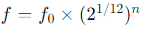

.. note::

    Hello, welcome to the SunFounder Raspberry Pi & Arduino & ESP32 Enthusiasts Community on Facebook! Dive deeper into Raspberry Pi, Arduino, and ESP32 with fellow enthusiasts.

    **Why Join?**

    - **Expert Support**: Solve post-sale issues and technical challenges with help from our community and team.
    - **Learn & Share**: Exchange tips and tutorials to enhance your skills.
    - **Exclusive Previews**: Get early access to new product announcements and sneak peeks.
    - **Special Discounts**: Enjoy exclusive discounts on our newest products.
    - **Festive Promotions and Giveaways**: Take part in giveaways and holiday promotions.

    👉 Ready to explore and create with us? Click [|link_sf_facebook|] and join today!

23. Play “Twinkle, Twinkle, Little Star”
===========================================
In this lesson, we delve into the fascinating intersection of music and technology. You'll learn how different musical pitches are produced through frequency changes, and how this principle can be applied using a microcontroller like Arduino to control a buzzer. By the end of this lesson, you will not only understand the basics of musical frequencies but also be able to program an Arduino to play a simple melody.

.. raw:: html

     <video controls style = "max-width:90%">
        <source src="../_static/video/23_little_star.mp4" type="video/mp4">
        Your browser does not support the video tag.
    </video>

By the end of this lesson, you will be able to:

* Learn how musical pitches correspond to specific frequencies.
* Simplify programming by using arrays to store and manipulate musical notes.
* Write and execute a program that controls a passive buzzer to play "Twinkle, Twinkle, Little Star" 

Musical Frequencies and Sound Production
----------------------------------------------
.. image:: img/7_sound.png
  :width: 400
  :align: center

Various musical instruments produce different pitches by changing the frequency.
For example, on a piano, striking the keys causes the corresponding strings to vibrate rapidly, producing specific pitches.
Scientists and musicians have developed various music tuning methods and pitch standards by precisely measuring these vibration frequencies.

When you control an Arduino or other microcontroller to send an electrical signal to a buzzer, the buzzer's diaphragm vibrates rapidly according to the frequency of the signal,
thereby producing sound. For example, a signal set to 440 Hz will produce the standard musical pitch "A4," which is a reference point in music tuning.
As the frequency increases or decreases, the pitch produced also rises or falls, thus achieving a range of pitches from low to high in musical composition.

In Western music, an octave includes 12 pitches (semitones), from C to B, and then back to a higher C.

For example, the frequency of Middle C (usually referred to as C4) is about 261.63 Hz. The frequency of a note can be calculated using the following formula:

where f_0 is the reference pitch (usually A4, frequency 440Hz), and n is the number of semitone steps from the reference pitch to the target pitch (positive numbers indicate a rise, negative numbers indicate a drop).
Using this formula, we can calculate the frequency of any note.

Here is a set of frequency tables:

* C (C4): 262 Hz (actually close to 261.63 Hz, rounded to 262)
* D (D4): 294 Hz
* E (E4): 330 Hz
* F (F4): 349 Hz
* G (G4): 392 Hz
* A (A4): 440 Hz
* B (B4): 494 Hz

Now we will explore the secrets of the notes through Arduino and a buzzer. Let's have the passive buzzer play the first two lines of "Twinkle, Twinkle, Little Star":

.. note::

  The melody of "Twinkle, Twinkle, Little Star" is based on simple note combinations,
  and the melody of this song is based on variations of "Ah vous dirai-je, Maman" by French composer Wolfgang Amadeus Mozart,
  which are very suitable for beginners to learn.

  Here is the basic sheet music for "Twinkle, Twinkle, Little Star," including each note:

  .. code-block:: 

    C C G G A A G
    F F E E D D C
    G G F F E E D
    G G F F E E D
    C C G G A A G
    F F E E D D C

Building the Circuit
-----------------------

**Components Needed**

.. list-table:: 
   :widths: 25 25 25 25
   :header-rows: 0

   * - 1 * Arduino Uno R3
     - 1 * Breadboard
     - 1 * Passive Buzzer
     - Jumper Wires
   * - |list_uno_r3| 
     - |list_breadboard| 
     - |list_passive_buzzer| 
     - |list_wire| 
   * - 1 * USB Cable
     -
     - 
     - 
   * - |list_usb_cable| 
     -
     - 
     - 

**Building Step-by-Step**

This lesson uses the same circuit as :ref:`ar_siren_sound`.

.. image:: img/16_morse_code.png
    :width: 500
    :align: center

Code Creation - Array
----------------------
1. Open the Arduino IDE and start a new project by selecting “New Sketch” from the “File” menu.
2. Save your sketch as ``Lesson23_Array`` using ``Ctrl + S`` or by clicking “Save”.

3. Now create an array at the very beginning of the code, storing the notes of Twinkle Twinkle Little Star into the array.

.. code-block:: Arduino

  // Define the frequencies for the notes of the C major scale (octave starting from middle C)
  int c = 262;
  int d = 294;
  int e = 330;
  int f = 349;
  int g = 392;
  int a = 440;
  int b = 494;
  int C = 523;  // High C

  // Define an array containing the sequence of notes in the melody
  int melody[] = { c, c, g, g, a, a, g, f, f, e, e, d, d, c, g, g, f, f, e, e, d, g, g, f, f, e, e, d, c, c, g, g, a, a, g, f, f, e, e, d, d, c };

An array is a data structure used to store multiple elements of the same type in Arduino programming.
It is a very basic and powerful tool, and when used properly, it can greatly enhance programming efficiency and program performance.
Arrays can store elements of types such as integers, floating-point numbers, and characters.

Similar to creating variables and functions, creating an array also involves specifying the array type and array name - ``int melody[]``.

The elements inside ``{}`` are called array elements, starting from index 0, so ``melody[0]`` equals the first ``c(262)``, and ``melody[13]`` is also ``c(262)``. 

4. Now print the elements at index 0 and 13 from the ``melody[]`` array in the serial monitor.

.. code-block:: Arduino
  :emphasize-lines: 17,18

  // Define the frequencies for the notes of the C major scale (octave starting from middle C)
  int c = 262;
  int d = 294;
  int e = 330;
  int f = 349;
  int g = 392;
  int a = 440;
  int b = 494;
  int C = 523;  // High C

  // Define an array containing the sequence of notes in the melody
  int melody[] = { c, c, g, g, a, a, g, f, f, e, e, d, d, c, g, g, f, f, e, e, d, g, g, f, f, e, e, d, c, c, g, g, a, a, g, f, f, e, e, d, d, c };

  void setup() {
    // put your setup code here, to run once:
    Serial.begin(9600);  // Initialize serial communication at 9600 baud rate
    Serial.println(melody[0]);
    Serial.println(melody[13]);
  }
  
  void loop() {
    // put your main code here, to run repeatedly:
  }

5. After uploading the code to the Arduino Uno R3, open the serial monitor, and you will see two 262s.

.. code-block::

  262
  262

6. If you want to print each element in the array ``melody[]`` one by one, you will first need to know the length of the array. You can use the ``sizeof()`` function to calculate the number of elements in the array.

.. code-block:: Arduino
  :emphasize-lines: 4

  void setup() {
    // put your setup code here, to run once:
    Serial.begin(9600);  // Initialize serial communication at 9600 baud rate
    int notes = sizeof(melody) / sizeof(melody[0]); // Calculate the number of element
  }

  
* ``sizeof(melody)`` gives the total bytes used by all elements in the array.
* ``sizeof(melody[0])`` gives the number of bytes used by one element of the array.
* Dividing the total bytes by the bytes per element gives the total number of elements in the array.

7. Then use a ``for`` statement to iterate through the elements in the array ``melody[]``, and print them out using the ``Serial.println()`` function.

.. code-block:: Arduino

  // Define the frequencies for the notes of the C major scale (octave starting from middle C)
  int c = 262;
  int d = 294;
  int e = 330;
  int f = 349;
  int g = 392;
  int a = 440;
  int b = 494;
  int C = 523;  // High C

  // Define an array containing the sequence of notes in the melody
  int melody[] = { c, c, g, g, a, a, g, f, f, e, e, d, d, c, g, g, f, f, e, e, d, g, g, f, f, e, e, d, c, c, g, g, a, a, g, f, f, e, e, d, d, c };

  void setup() {
    // put your setup code here, to run once:
    Serial.begin(9600);                              // Initialize serial communication at 9600 baud rate
    int notes = sizeof(melody) / sizeof(melody[0]);  // Calculate the number of element
    // Loop through each note in the melody array
    for (int i = 0; i < notes; i = i + 1) {
      // Print each note's frequency to the serial monitor
      Serial.println(melody[i]);
    }
  }

  void loop() {
    // put your main code here, to run repeatedly:
  }

8. After uploading the code to the Arduino Uno R3, open the serial monitor, and you will see the elements in the array ``melody[]`` printed one by one.

.. code-block::

  262
  262
  392
  392
  440
  440
  392
  349
  349
  330
  ...

**Questions**

You can also perform operations on the elements in the array, such as changing to ``Serial.println(melody[i] * 1.3);`` What data will you get and why?

Code Creation - Play Little Star 
-----------------------------------

Now that we have a solid understanding of creating arrays, accessing array elements, and calculating their lengths and operations, let's apply this knowledge to program a passive buzzer to play 'Twinkle, Twinkle, Little Star' using stored frequencies and intervals.

1. Open the sketch you saved earlier, ``Lesson23_Array``. Hit “Save As...” from the “File” menu, and rename it to ``Lesson23_Little_Star``. Click "Save".

2. First, define the buzzer pin.

.. code-block:: Arduino

  const int buzzerPin = 9;  // Assigns the pin 9 to the constant for the buzzer

3. Now create another array to store the duration of the notes.

.. code-block:: Arduino
  :emphasize-lines: 3

  // Set up the sequence of notes and their durations in milliseconds
  int melody[] = { c, c, g, g, a, a, g, f, f, e, e, d, d, c, g, g, f, f, e, e, d, g, g, f, f, e, e, d, c, c, g, g, a, a, g, f, f, e, e, d, d, c };
  int noteDurations[] = { 500, 500, 500, 500, 500, 500, 1000, 500, 500, 500, 500, 500, 500, 1000, 500, 500, 500, 500, 500, 500, 1000, 500, 500, 500, 500, 500, 500, 1000, 500, 500, 500, 500, 500, 500, 1000, 500, 500, 500, 500, 500, 500, 1000 };

4. Now move part of the code from ``void setup()`` into ``void loop()``.

.. code-block:: Arduino
  :emphasize-lines: 8-13

  void setup() {
    // put your setup code here, to run once:
    Serial.begin(9600);                              // Initialize serial communication at 9600 baud rate
  }

  void loop() {
    // put your main code here, to run repeatedly:
    int notes = sizeof(melody) / sizeof(melody[0]);  // Calculate the number of element
    // Loop through each note in the melody array
    for (int i = 0; i < notes; i = i + 1) {
      // Print each note's frequency to the serial monitor
      Serial.println(melody[i]);
    }
  }

5. In the ``for`` statement, comment out the printing code and use the ``tone()`` function to play the notes.

.. code-block:: Arduino
  :emphasize-lines: 9

  void loop() {
    // put your main code here, to run repeatedly:
    int notes = sizeof(melody) / sizeof(melody[0]);  // Calculate the number of element
    // Loop through each note in the melody array
    for (int i = 0; i < notes; i = i + 1) {
      // Print each note's frequency to the serial monitor
      // Serial.println(melody[i]);

      tone(buzzerPin, melody[i], noteDurations[i]);  // Play the note
    }
  }

6. After each note is played, to make the melody more natural, add a brief pause between two notes. Here we multiply the duration of the notes by 1.30 to calculate the interval, making the melody sound less hurried.

.. code-block:: Arduino
  :emphasize-lines: 10

  void loop() {
    // put your main code here, to run repeatedly:
    int notes = sizeof(melody) / sizeof(melody[0]);  // Calculate the number of element
    // Loop through each note in the melody array
    for (int i = 0; i < notes; i = i + 1) {
      // Print each note's frequency to the serial monitor
      // Serial.println(melody[i]);

      tone(buzzerPin, melody[i], noteDurations[i]);  // Play the note
      delay(noteDurations[i] * 1.30);                // Wait before changing the note
    }
  }

7. Use the ``noTone()`` function to stop the tone output from the current pin. This is a necessary step to ensure each note is clearly played without blending into the next one.

.. code-block:: Arduino
  :emphasize-lines: 11

  void loop() {
    // put your main code here, to run repeatedly:
    int notes = sizeof(melody) / sizeof(melody[0]);  // Calculate the number of element
    // Loop through each note in the melody array
    for (int i = 0; i < notes; i = i + 1) {
      // Print each note's frequency to the serial monitor
      // Serial.println(melody[i]);

      tone(buzzerPin, melody[i], noteDurations[i]);  // Play the note
      delay(noteDurations[i] * 1.30);                // Wait before changing the note
      noTone(buzzerPin);                             // Stop playing the note
    }
  }

8. Your complete code is shown below, and once you upload the code to the Arduino Uno R3, you will be able to hear the buzzer playing "Twinkle Twinkle Little Star".

.. code-block:: Arduino

  int buzzerPin = 9;  // Assigns the pin 9 to the constant for the buzzer

  // Define the frequencies for the notes of the C major scale (octave starting from middle C)
  int c = 262;
  int d = 294;
  int e = 330;
  int f = 349;
  int g = 392;
  int a = 440;
  int b = 494;
  int C = 523;  // High C

  // Set up the sequence of notes and their durations in milliseconds
  int melody[] = { c, c, g, g, a, a, g, f, f, e, e, d, d, c, g, g, f, f, e, e, d, g, g, f, f, e, e, d, c, c, g, g, a, a, g, f, f, e, e, d, d, c };
  int noteDurations[] = { 500, 500, 500, 500, 500, 500, 1000, 500, 500, 500, 500, 500, 500, 1000, 500, 500, 500, 500, 500, 500, 1000, 500, 500, 500, 500, 500, 500, 1000, 500, 500, 500, 500, 500, 500, 1000, 500, 500, 500, 500, 500, 500, 1000 };

  void setup() {
    // put your setup code here, to run once:
    Serial.begin(9600);                              // Initialize serial communication at 9600 baud rate
  }

  void loop() {
    // put your main code here, to run repeatedly:
    int notes = sizeof(melody) / sizeof(melody[0]);  // Calculate the number of element
    // Loop through each note in the melody array
    for (int i = 0; i < notes; i = i + 1) {
      // Print each note's frequency to the serial monitor
      // Serial.println(melody[i]);

      tone(buzzerPin, melody[i], noteDurations[i]);  // Play the note
      delay(noteDurations[i] * 1.30);                // Wait before changing the note
      noTone(buzzerPin);                             // Stop playing the note
    }
  }
  
9. Finally, remember to save your code and tidy up your workspace.

**Question**

If you replace the passive buzzer in the circuit with an active buzzer, can you positively play “Twinkle Twinkle Little Star”? Why?

**Summary**

Now that the class is over, in this lesson we learned how to use arrays to store data, calculate array lengths, index elements within an array, and perform operations on each element. By storing note frequencies and timing intervals in arrays and iterating through them with a for loop, we successfully programmed a passive buzzer to play 'Twinkle, Twinkle, Little Star'.

Additionally, we learned how to pause the playback of a note using the ``noTone()`` function.

This lesson not only reinforced our understanding of array operations and control structures in programming but also demonstrated how these concepts can be applied to create music with electronic components, linking theoretical knowledge with practical applications in a fun and engaging way.

