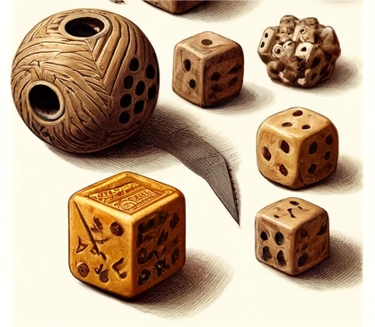
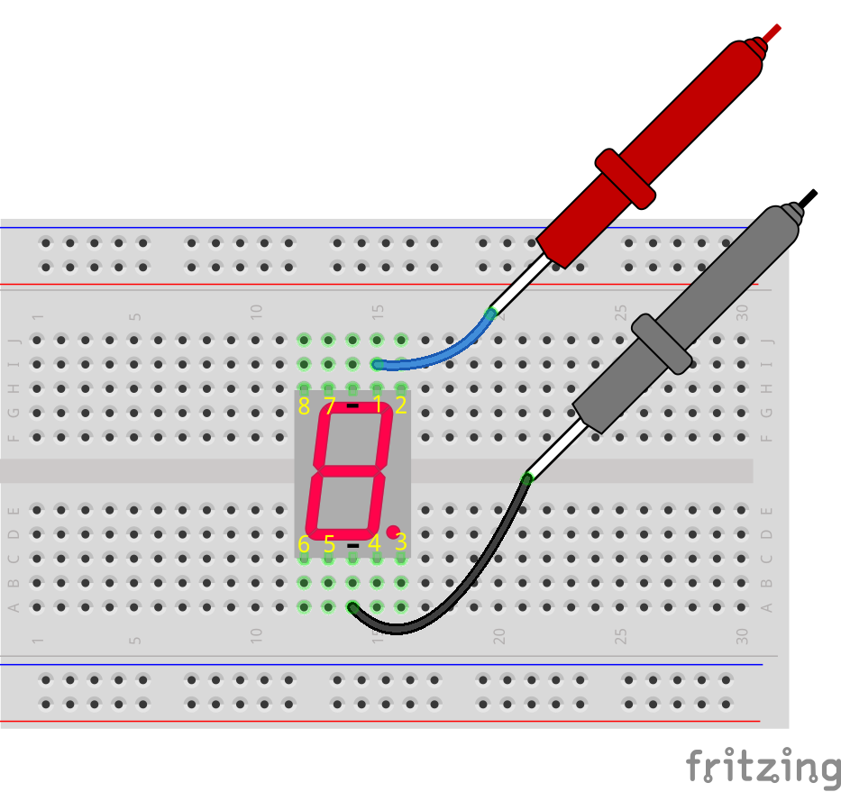
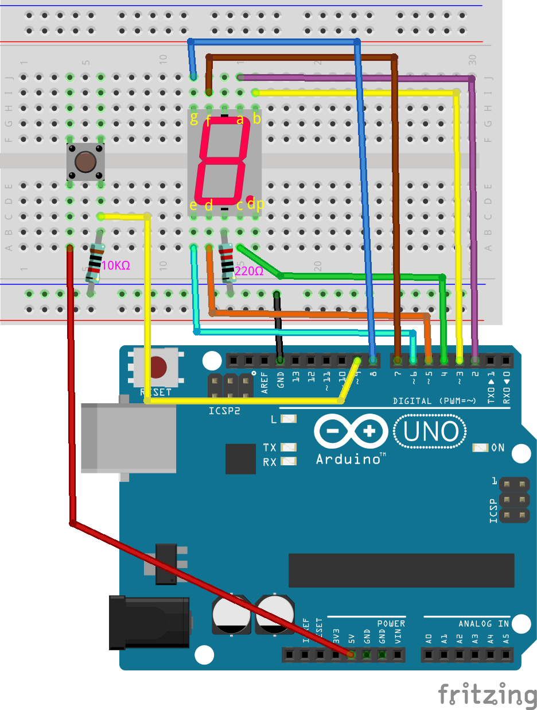
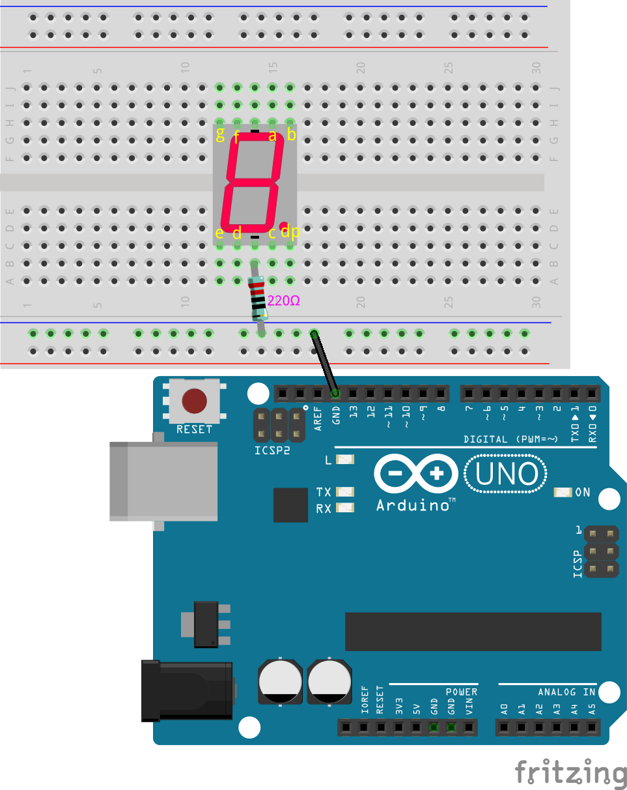
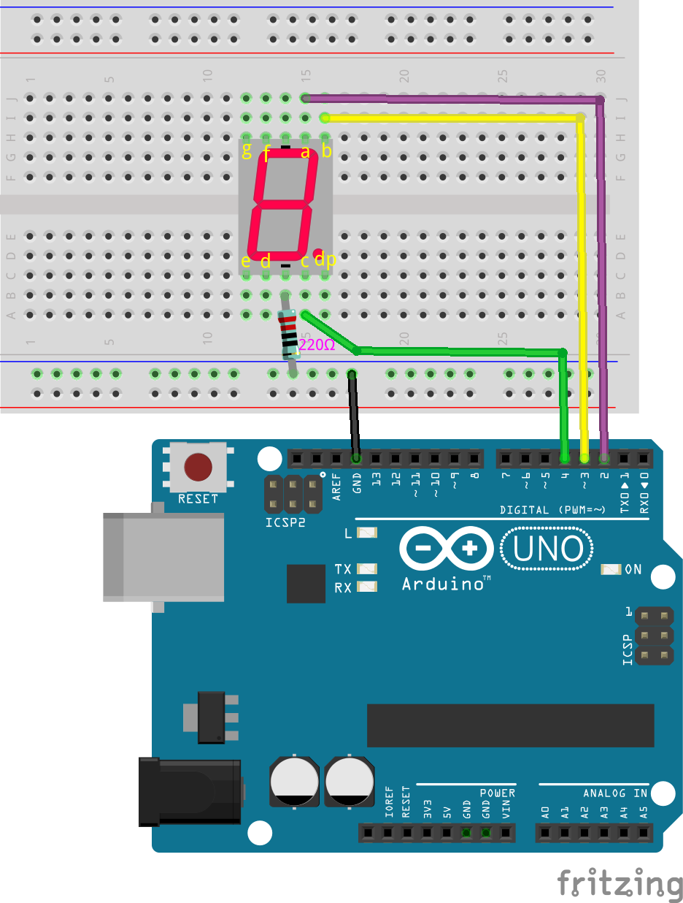
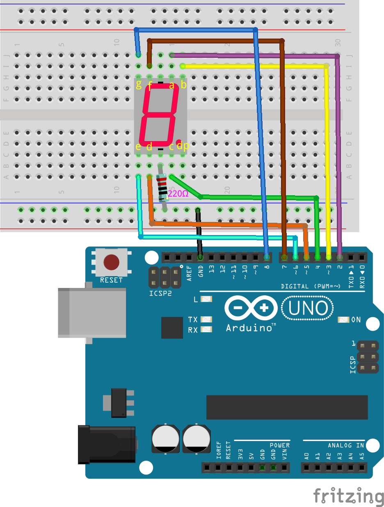
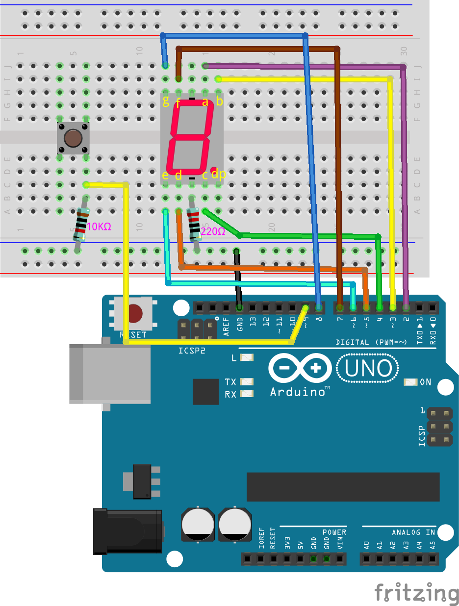

.. note::

    Hello, welcome to the SunFounder Raspberry Pi & Arduino & ESP32 Enthusiasts Community on Facebook! Dive deeper into Raspberry Pi, Arduino, and ESP32 with fellow enthusiasts.

    **Why Join?**

    - **Expert Support**: Solve post-sale issues and technical challenges with help from our community and team.
    - **Learn & Share**: Exchange tips and tutorials to enhance your skills.
    - **Exclusive Previews**: Get early access to new product announcements and sneak peeks.
    - **Special Discounts**: Enjoy exclusive discounts on our newest products.
    - **Festive Promotions and Giveaways**: Take part in giveaways and holiday promotions.

    👉 Ready to explore and create with us? Click [|link_sf_facebook|] and join today!

26. Cyber Dice
=======================

In this lesson, we embark on an exciting journey through two projects involving digital electronics and programming.

.. image:: img/23_dice.jpg
    :align: center
    :width: 500

Initially, we will delve into the operation of a 7-segment display, learning how to control it to show numbers step-by-step. Following that, we will create an electronic dice! By simply pressing a button, a random number ranging from 1 to 6 will appear on the 7-segment display, offering a digital twist to traditional dice.

.. raw:: html

    <video muted controls style = "max-width:90%">
        <source src="../_static/video/26_cycle_dice.mp4" type="video/mp4">
        Your browser does not support the video tag.
    </video>

During this lesson, you will learn:

* The principles of how a 7-segment display works and how to make it function.
* The use of switch-case statements to simplify code logic.
* How to utilize a while loop to maintain the current state until a change is required.
* How to construct the Cyber Dice project, integrating simple electronics with interactive programming for practical application.

The Origin of Dice
-----------------------

Dice are among the oldest gambling tools in the world, with a history dating back thousands of years before the Common Era. They originated around 3000 BCE in ancient Egypt, typically made from bones, ivory, or other natural materials. These early dice were often irregular in shape and sometimes not entirely symmetrical.

Dice were also found in ancient Mesopotamia (modern-day Iraq) around the same time. Ancient diviners and religious leaders used dice to make decisions or predict the future, highlighting their significance in religious and mystical rites.

Over time, the shape and manufacturing techniques of dice became standardized. By the 1st century BCE, dice were widely used in the Roman Empire, not only for gambling but also for social and entertainment purposes.

In Asia, particularly in India, dice usage is documented in the ancient epic, the Mahabharata, where a pivotal dice game plays a crucial role in the storyline.

During the Renaissance, dice production became more refined, and materials diversified to include wood, bone, ivory, and even metal. Today, dice are not just tools for entertainment and gambling but are also used in education, decision-making support, and various tabletop games. Their history and diversity reflect the evolution of human culture and technology, offering a fascinating window into the exploration of chance and luck.

.. _learn_7segment:

Learn the 7-Segment Display
-------------------------------------------

1. Find a 7-segment display. 

A 7-segment display is an 8-shaped component that packages 7 LEDs. Each of the LEDs in the display is given a positional segment with one of its connection pins led out from the rectangular plastic package. These LED pins are labeled from "a" to "g" representing each individual LED. 
The other LED pins are connected together forming a common pin. An additional 8th LED used within the same package thus allowing the indication of a decimal point (DP) when two or more 7-segment displays are connected together to display numbers greater than ten.

.. image:: img/23_7_segment.png
    :width: 300
    :align: center

The common pin of the display generally tells its type. There are two types of pin connections: one with connected cathodes and another with connected anodes, indicating Common Cathode (CC) and Common Anode (CA). As the name suggests, a CC display has all the cathodes of the 7 LEDs connected, while a CA display has all the anodes of the 7 segments connected.

.. note::

    Usually, there is a label on the side of the 7-segment display, xxxAx or xxxBx. Generally, xxxAx stands for common cathode and xxxBx stands for common anode. The displays in our kit are common cathode.

.. image:: img/23_segment_cathode_1.png
    :align: center
    :width: 600

To determine whether a 7-segment display is common cathode or common anode, you can use a multimeter. You can also use a multimeter to test if each segment of the display is working properly, as follows:

1. Set the multimeter to diode test mode. The diode test is a function of the multimeter used to check the forward conduction of diodes or similar semiconductor devices (such as LEDs). The multimeter passes a small current through the diode. If the diode is intact, it will allow the current to pass.

.. image:: img/multimeter_diode.png
    :width: 300
    :align: center

2. Insert the 7-segment display into a breadboard, noting that the decimal point is at the bottom right and ensure to spans the middle gap. Insert a wire in the same row as pin 1 of the display, and touch it with the red lead of the multimeter. Insert another wire in the same row as any “-” pin of the display, and touch it with the black lead.

3. Observe whether any LED segment lights up. If so, it indicates that the display is common cathode. If not, swap the red and black leads; if a segment lights up after swapping, it indicates that the display is common anode.

4. If a segment lights up, refer to this diagram to record the segment's pin number and approximate position in the Handbook's table.

.. image:: img/23_segment_2.png
    :align: center

.. list-table::
    :widths: 20 20 40
    :header-rows: 1

    *   - Pin
        - Segment Number
        - Position
    *   - 1
        - a
        - The top segment
    *   - 2
        -
        - 
    *   - 3
        -
        - 
    *   - 4
        -
        - 
    *   - 5
        -
        - 
    *   - 6
        -
        - 
    *   - 7
        -
        - 
    *   - 8
        -
        -     

5. Repeat the above steps, keeping the black lead on the “-” pin, and connect the red lead to the other pins to find out the control pins corresponding to the LED segments of the display.

**Question**

From the tests above, it is known that the display in the kit is common cathode, which means you only need to connect the common pin to GND and provide a high voltage to the other pins to light up the corresponding segments. If you want the display to show the number 2, which pins should be provided with a high voltage? Why?

.. image:: img/23_segment_2.png
    :align: center

Building the Circuit
--------------------------------

**Components Needed**

.. list-table:: 
   :widths: 25 25 25 25
   :header-rows: 0

   * - 1 * Arduino Uno R3
     - 1 * 7-segment Display
     - 1 * 220Ω Resistor
     - 1 * 10KΩ Resistor
   * - |list_uno_r3| 
     - |list_7segment| 
     - |list_220ohm| 
     - |list_10kohm| 
   * - 1 * Button
     - 1 * Breadboard
     - Jumper Wires
     - 1 * USB Cable
   * - |list_button| 
     - |list_breadboard| 
     - |list_wire| 
     - |list_usb_cable| 
   * - 1 * Multimeter
     - 
     - 
     - 
   * - |list_meter| 
     - 
     - 
     - 

**Building Step-by-Step**

Follow the wiring diagram, or the steps below to build your circuit.

1. Insert the 7-segment display into the breadboard with the decimal point at the bottom right corner.

.. image:: img/23_segment_segment.png
    :align: center
    :width: 500

2. Insert one end of a 220Ω resistor into the negative (“-”) terminal of the 7-segment display, and the other end into the negative rail of the breadboard. Then connect the breadboard’s negative rail to the GND pin of the Arduino Uno R3 with a jumper wire.

3. Connect the pins controlling the a, b, c segments of the LED to pins 2, 3, and 4 on the Arduino Uno R3.

4. Connect the pins controlling the d, e, f, g segments of the LED to pins 5, 6, 7, and 8 on the Arduino Uno R3.

5. Now insert a button into the breadboard.

.. image:: img/23_segment_button.png
    :align: center
    :width: 500

6. Connect the lower right pin of the button to pin 9 of R3 with a wire.

.. image:: img/23_segment_pin9.png
    :align: center
    :width: 500

7. Connect a 10K pull-down resistor to the button so that when the button is not pressed, pin 9 remains at a low level and does not bounce.

8. Connect the lower left pin of the button to the 5V on the Arduino Uno R3.

.. list-table::
    :widths: 20 20
    :header-rows: 1

    *   - 7-segment Display
        - Arduino UNO R3
    *   - a
        - 2
    *   - b
        - 3 
    *   - c
        - 4
    *   - d
        - 5
    *   - e
        - 6
    *   - f
        - 7
    *   - g
        - 8

Code Creation - Displaying Numbers
-------------------------------------
1. Open the Arduino IDE and start a new project by selecting “New Sketch” from the “File” menu.
2. Save your sketch as ``Lesson26_Show_Number`` using ``Ctrl + S`` or by clicking “Save”.

3. Define pins connected to the 7-segment display and set all pins as outputs.

.. code-block:: Arduino

    // Define pins connected to the 7-segment display
    int pinA = 2;
    int pinB = 3;
    int pinC = 4;
    int pinD = 5;
    int pinE = 6;
    int pinF = 7;
    int pinG = 8;

    void setup() {
        // Set all pins as outputs
        pinMode(pinA, OUTPUT);
        pinMode(pinB, OUTPUT);
        pinMode(pinC, OUTPUT);
        pinMode(pinD, OUTPUT);
        pinMode(pinE, OUTPUT);
        pinMode(pinF, OUTPUT);
        pinMode(pinG, OUTPUT);
    }

4. Now write code to make the 7-segment display show a number, such as the number 2. To display the number 2, set segments F and C to LOW (off), other segments to HIGH (on).

.. code-block:: Arduino
  :emphasize-lines: 22-29

    // Define pins connected to the 7-segment display
    int pinA = 2;
    int pinB = 3;
    int pinC = 4;
    int pinD = 5;
    int pinE = 6;
    int pinF = 7;
    int pinG = 8;

    void setup() {
        // Set all pins as outputs
        pinMode(pinA, OUTPUT);
        pinMode(pinB, OUTPUT);
        pinMode(pinC, OUTPUT);
        pinMode(pinD, OUTPUT);
        pinMode(pinE, OUTPUT);
        pinMode(pinF, OUTPUT);
        pinMode(pinG, OUTPUT);
    }

    void loop() {
        // Set segments F and C to LOW (off), other segments to HIGH (on)
        digitalWrite(pinA, HIGH);
        digitalWrite(pinB, HIGH);
        digitalWrite(pinC, LOW);
        digitalWrite(pinD, HIGH);
        digitalWrite(pinE, HIGH);
        digitalWrite(pinF, LOW);
        digitalWrite(pinG, HIGH);
    }

5. Now you can upload the code to the Arduino Uno R3, and you will see the number 2 displayed on the 7-segment display.

6. If you need to display other numbers, such as cycling through 1 to 6, using ``digitalWrite()`` to set each segment would make the code very long and the logic less clear. Here we use a function creation method instead.

7. Create a function with a parameter - ``displayDigit()``, which first turns off all LED segments of the 7-segment display.

.. code-block:: Arduino

    void displayDigit(int digit) {
        // Turn off all segments
        digitalWrite(pinA, LOW);
        digitalWrite(pinB, LOW);
        digitalWrite(pinC, LOW);
        digitalWrite(pinD, LOW);
        digitalWrite(pinE, LOW);
        digitalWrite(pinF, LOW);
        digitalWrite(pinG, LOW);
    }

8. Next, control different LED segments to display numbers. Here we could use ``if-else`` statements, but that might be cumbersome. Thus, a ``switch`` statement provides a clearer and more organized way to choose among multiple possible different behaviors than multiple ``if-else`` statements.

In programming, a ``switch`` statement is a control structure used to execute different code segments based on the value of a variable.

The basic syntax of a switch statement is usually as follows:

.. code-block:: Arduino

    switch (expression) {
        case value1:
            // code
            break;
        case value2:
            // code
            break;
        default:
            // code
    }

* ``expression``: This is an expression that typically returns an integer or character, based on which the switch statement decides which ``case`` to execute.
* ``case``: Each ``case`` keyword is followed by a value that can match the result of ``expression``. If a match is successful, the code is executed from this point until a ``break`` statement is encountered.
* ``break``: The ``break`` statement is used to exit the ``switch`` block. Without ``break``, the program would continue executing the next case's code, regardless of its match, which is known as "fall-through".
* ``default``: The ``default`` part is optional and is executed if no ``case`` matches, similar to ``else`` in an ``if-else`` structure.

.. image:: img/23_flow_swtich.png
    :align: center
    :width: 600

9. Use the ``switch-case`` in the ``displayDigit()`` function to complete the display of numbers on the 7-segment display. For instance, to display 1, only segments B and C need to be high; to display 2, segments F and C need to be low, while the others are high.

.. code-block:: Arduino

    void displayDigit(int digit) {
        // Turn off all segments
        digitalWrite(pinA, LOW);
        digitalWrite(pinB, LOW);
        digitalWrite(pinC, LOW);
        digitalWrite(pinD, LOW);
        digitalWrite(pinE, LOW);
        digitalWrite(pinF, LOW);
        digitalWrite(pinG, LOW);

        // Set to HIGH to turn on the segments needed for the desired number
        switch (digit) {
            case 1:
                digitalWrite(pinB, HIGH);
                digitalWrite(pinC, HIGH);
                break;
            case 2:
                digitalWrite(pinA, HIGH);
                digitalWrite(pinB, HIGH);
                digitalWrite(pinD, HIGH);
                digitalWrite(pinE, HIGH);
                digitalWrite(pinG, HIGH);
                break;
            case 3:
                digitalWrite(pinA, HIGH);
                digitalWrite(pinB, HIGH);
                digitalWrite(pinC, HIGH);
                digitalWrite(pinD, HIGH);
                digitalWrite(pinG, HIGH);
                break;
            case 4:
                digitalWrite(pinB, HIGH);
                digitalWrite(pinC, HIGH);
                digitalWrite(pinF, HIGH);
                digitalWrite(pinG, HIGH);
                break;
            case 5:
                digitalWrite(pinA, HIGH);
                digitalWrite(pinC, HIGH);
                digitalWrite(pinD, HIGH);
                digitalWrite(pinF, HIGH);
                digitalWrite(pinG, HIGH);
                break;
            case 6:
                digitalWrite(pinA, HIGH);
                digitalWrite(pinC, HIGH);
                digitalWrite(pinD, HIGH);
                digitalWrite(pinE, HIGH);
                digitalWrite(pinF, HIGH);
                digitalWrite(pinG, HIGH);
                break;
        }
    }

10. Now you can call ``displayDigit()`` in the ``void loop()`` to display specific numbers, such as cycling between 3 and 6, with a one-second interval.

.. code-block:: Arduino

    void loop() {

        displayDigit(3);  // Display the 3 on the 7-segment display
        delay(1000);
        displayDigit(6);  // Display the 6 on the 7-segment display
        delay(1000);
    }

11. Below is your complete code. Now you can upload the code to the Arduino Uno R3, and you will see the 7-segment display cycle through displaying 3 and 6.

.. code-block:: Arduino

    // Define pins connected to the 7-segment display
    int pinA = 2;
    int pinB = 3;
    int pinC = 4;
    int pinD = 5;
    int pinE = 6;
    int pinF = 7;
    int pinG = 8;

    void setup() {
        // Set all pins as outputs
        pinMode(pinA, OUTPUT);
        pinMode(pinB, OUTPUT);
        pinMode(pinC, OUTPUT);
        pinMode(pinD, OUTPUT);
        pinMode(pinE, OUTPUT);
        pinMode(pinF, OUTPUT);
        pinMode(pinG, OUTPUT);
    }

    void loop() {

        displayDigit(3);  // Display the 3 on the 7-segment display
        delay(1000);
        displayDigit(6);  // Display the 6 on the 7-segment display
        delay(1000);
    }

    void displayDigit(int digit) {
        // Turn off all segments
        digitalWrite(pinA, LOW);
        digitalWrite(pinB, LOW);
        digitalWrite(pinC, LOW);
        digitalWrite(pinD, LOW);
        digitalWrite(pinE, LOW);
        digitalWrite(pinF, LOW);
        digitalWrite(pinG, LOW);

        // Turn on the segments needed for the desired number (HIGH turns on the segments for common cathode)
        switch (digit) {
            case 1:
                digitalWrite(pinB, HIGH);
                digitalWrite(pinC, HIGH);
                break;
            case 2:
                digitalWrite(pinA, HIGH);
                digitalWrite(pinB, HIGH);
                digitalWrite(pinD, HIGH);
                digitalWrite(pinE, HIGH);
                digitalWrite(pinG, HIGH);
                break;
            case 3:
                digitalWrite(pinA, HIGH);
                digitalWrite(pinB, HIGH);
                digitalWrite(pinC, HIGH);
                digitalWrite(pinD, HIGH);
                digitalWrite(pinG, HIGH);
                break;
            case 4:
                digitalWrite(pinB, HIGH);
                digitalWrite(pinC, HIGH);
                digitalWrite(pinF, HIGH);
                digitalWrite(pinG, HIGH);
                break;
            case 5:
                digitalWrite(pinA, HIGH);
                digitalWrite(pinC, HIGH);
                digitalWrite(pinD, HIGH);
                digitalWrite(pinF, HIGH);
                digitalWrite(pinG, HIGH);
                break;
            case 6:
                digitalWrite(pinA, HIGH);
                digitalWrite(pinC, HIGH);
                digitalWrite(pinD, HIGH);
                digitalWrite(pinE, HIGH);
                digitalWrite(pinF, HIGH);
                digitalWrite(pinG, HIGH);
                break;
        }
    }

Code Creation - Cyber Dice
-------------------------------------
Now that we know how to display numbers 1-6 on the 7-segment display, how can we achieve the effect of a Cyber Dice?

This involves pressing a button to make the display cycle through numbers 1 to 6, and releasing the button to show a stable number. Let's see how we can achieve this with code.

1. Open the sketch you saved earlier, ``Lesson26_Show_Number``. Hit “Save As...” from the “File” menu, and rename it to ``Lesson26_Cyber_Dice``. Click "Save".

2. Define the button pin and set it as an input.

.. code-block:: Arduino
    :emphasize-lines: 10-11,23-24

    // Define the pins connected to the segments of the 7-segment display
    int pinA = 2;
    int pinB = 3;
    int pinC = 4;
    int pinD = 5;
    int pinE = 6;
    int pinF = 7;
    int pinG = 8;

    // Define the pin connected to the button
    int buttonPin = 9;

    void setup() {
        // Set all pins as outputs
        pinMode(pinA, OUTPUT);
        pinMode(pinB, OUTPUT);
        pinMode(pinC, OUTPUT);
        pinMode(pinD, OUTPUT);
        pinMode(pinE, OUTPUT);
        pinMode(pinF, OUTPUT);
        pinMode(pinG, OUTPUT);

        // Set the button pin as an input
        pinMode(buttonPin, INPUT);
    }

3. Check if the button is pressed at the moment when the ``void loop()`` function runs. If the button is not pressed, the code inside the ``if`` block is skipped.

.. code-block:: Arduino
    :emphasize-lines: 3,4

    void loop() {
        // Check if the button is pressed
        if (digitalRead(buttonPin) == HIGH) {
        }
    }

4. In Arduino or similar microcontroller programming, a common issue when dealing with button input is ensuring that each press triggers only one action, especially when generating events or commands (such as generating a random number). To address this, we can use a technique known as "wait-for-release".

**wait-for-release**

The core idea of this method is that after a button is pressed and an action is performed, the program enters a loop that continues to monitor the button state until it is released. This is to ensure that no additional actions are triggered due to button bouncing or the user holding down the button.

We can implement this with a ``while`` loop in the code.

.. image:: img/while_loop.png
    :width: 400
    :align: center

.. code-block:: Arduino
    :emphasize-lines: 4-6

    void loop() {
        // Check if the button is pressed
        if (digitalRead(buttonPin) == HIGH) {
            // Wait for the button to be released before continuing
            while (digitalRead(buttonPin) == HIGH) {
            }
        }
    }

5. Now, use the ``random()`` function to generate a random number between 1 and 6, and use ``displayDigit()`` to display this number on the 7-segment display. You will see the display rapidly rolling through different numbers while the button is held down.

In the physical world, randomness abounds, but in programming, so-called "random" numbers are usually computed through a deterministic algorithm. This algorithm typically requires a starting point known as a "seed," making these numbers predictable and thus called "pseudo-random." The "pseudo" prefix indicates that these numbers seem random but are actually patterned.

Interestingly, on an Arduino Uno R3, we can use physical measurements from the real world as seeds. During your measurements with a multimeter, you might notice minor fluctuations in the circuit's voltage and current values. These fluctuations can provide unpredictability to our random numbers.

Arduino's approach to randomness involves several functions:

* ``randomSeed();``: Initializing the random number generator's seed value. This function ensures that the starting point of the random number sequence varies with each program run, thus producing different sequences. 

    **Parameters**
        * ``seed``: A value used to initialize the random number generator. This unsigned long value sets the starting point of the random sequence.
    **Returns**
        None.

* ``long random(long max);``: Generating a random number within a specified range.

    **Parameters**
        ``max``: The upper limit of the random number (``max`` itself not included), meaning the random number will be between 0 (inclusive) and ``max-1`` (inclusive).
    
    **Returns**
        A long type number between 0 and max-1.

* ``long random(long min, long max);``: Generating a random number within a specified range.

    **Parameters**
        ``min``: The lower limit of the random number (inclusive).
        ``max``: The upper limit of the random number (``max`` itself not included), meaning the random number will be between min (inclusive) and max-1 (inclusive).
    
    **Returns**
        A long type number between min and max-1.

.. code-block:: Arduino
    :emphasize-lines: 6-12

    void loop() {
        // Check if the button is pressed
        if (digitalRead(buttonPin) == HIGH) {
            // Wait for the button to be released before continuing
            while (digitalRead(buttonPin) == HIGH) {
                // Generate a random number between 1 and 6
                int num = random(1, 7);
                
                // Display the random number on the 7-segment display
                displayDigit(num);
                // Delay for a short period to allow visible display updates
                delay(100);
            }
        }
    }

6. Finally, add a delay to debounce the button and prevent multiple rapid inputs.

.. code-block:: Arduino
    :emphasize-lines: 15

    void loop() {
        // Check if the button is pressed
        if (digitalRead(buttonPin) == HIGH) {
            // Wait for the button to be released before continuing
            while (digitalRead(buttonPin) == HIGH) {
                // Generate a random number between 1 and 6
                int num = random(1, 7);
                
                // Display the random number on the 7-segment display
                displayDigit(num);
                // Delay for a short period to allow visible display updates
                delay(100);
            }
            // Add a delay to debounce the button and prevent multiple rapid inputs
            delay(500);
        }
    }

7. Your complete code should look like this, and now you can upload the code to the Arduino Uno R3. Once the code is uploaded, if you hold down the button, the numbers on the display will cycle rapidly, and when released, a number will be shown.

.. code-block:: Arduino

    // Define the pins connected to the segments of the 7-segment display
    int pinA = 2;
    int pinB = 3;
    int pinC = 4;
    int pinD = 5;
    int pinE = 6;
    int pinF = 7;
    int pinG = 8;

    // Define the pin connected to the button
    int buttonPin = 9;

    void setup() {
        // Set all pins as outputs
        pinMode(pinA, OUTPUT);
        pinMode(pinB, OUTPUT);
        pinMode(pinC, OUTPUT);
        pinMode(pinD, OUTPUT);
        pinMode(pinE, OUTPUT);
        pinMode(pinF, OUTPUT);
        pinMode(pinG, OUTPUT);

        // Set the button pin as an input
        pinMode(buttonPin, INPUT);
    }

    void loop() {
        // Check if the button is pressed
        if (digitalRead(buttonPin) == HIGH) {
            // Wait for the button to be released before continuing
            while (digitalRead(buttonPin) == HIGH) {
                // Generate a random number between 1 and 6
                int num = random(1, 7);

                // Display the random number on the 7-segment display
                displayDigit(num);
                // Delay for a short period to allow visible display updates
                delay(100);
            }
            // Add a delay to debounce the button and prevent multiple rapid inputs
            delay(500);
        }
    }

    void displayDigit(int digit) {
        // Turn off all segments
        digitalWrite(pinA, LOW);
        digitalWrite(pinB, LOW);
        digitalWrite(pinC, LOW);
        digitalWrite(pinD, LOW);
        digitalWrite(pinE, LOW);
        digitalWrite(pinF, LOW);
        digitalWrite(pinG, LOW);

        // Turn on the segments needed for the desired number (LOW turns on the segments for common cathode)
        switch (digit) {
            case 1:
            digitalWrite(pinB, HIGH);
            digitalWrite(pinC, HIGH);
            break;
            case 2:
            digitalWrite(pinA, HIGH);
            digitalWrite(pinB, HIGH);
            digitalWrite(pinD, HIGH);
            digitalWrite(pinE, HIGH);
            digitalWrite(pinG, HIGH);
            break;
            case 3:
            digitalWrite(pinA, HIGH);
            digitalWrite(pinB, HIGH);
            digitalWrite(pinC, HIGH);
            digitalWrite(pinD, HIGH);
            digitalWrite(pinG, HIGH);
            break;
            case 4:
            digitalWrite(pinB, HIGH);
            digitalWrite(pinC, HIGH);
            digitalWrite(pinF, HIGH);
            digitalWrite(pinG, HIGH);
            break;
            case 5:
            digitalWrite(pinA, HIGH);
            digitalWrite(pinC, HIGH);
            digitalWrite(pinD, HIGH);
            digitalWrite(pinF, HIGH);
            digitalWrite(pinG, HIGH);
            break;
            case 6:
            digitalWrite(pinA, HIGH);
            digitalWrite(pinC, HIGH);
            digitalWrite(pinD, HIGH);
            digitalWrite(pinE, HIGH);
            digitalWrite(pinF, HIGH);
            digitalWrite(pinG, HIGH);
            break;
        }
    }

8. Finally, remember to save your code and tidy up your workspace.

**Summary**

In this lesson, we've successfully completed the Cyber Dice project, enabling you to engage in friendly competitions with friends to see who can roll the highest number. Throughout this lesson, we explored the workings of a 7-segment display, learning how to drive it effectively. We simplified our code using switch-case statements, enhancing readability and efficiency.

Furthermore, we implemented logic to control the display of random numbers on the 7-segment display based on the state of a button press, adding dynamic interaction to our project. This hands-on experience not only familiarizes you with basic electronic components and coding strategies but also illustrates practical applications of these skills in creating engaging and interactive projects.
