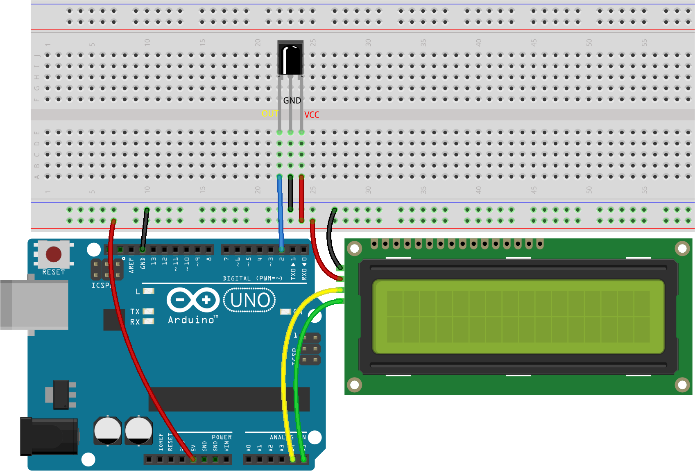
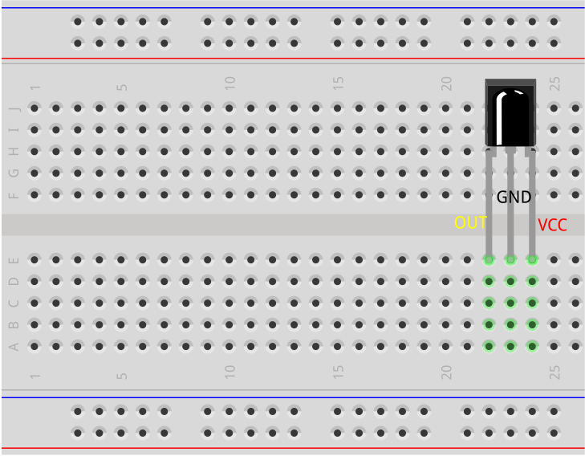
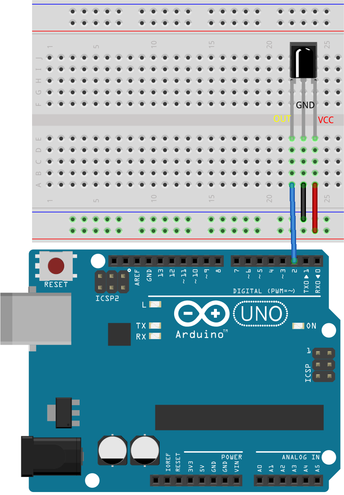
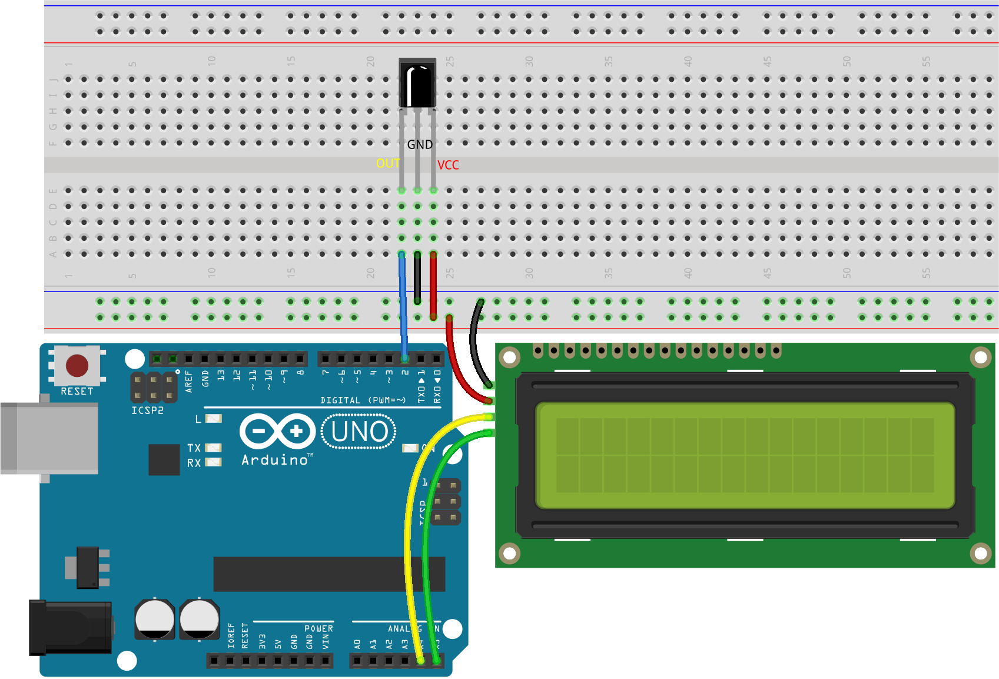

.. note::

    Hello, welcome to the SunFounder Raspberry Pi & Arduino & ESP32 Enthusiasts Community on Facebook! Dive deeper into Raspberry Pi, Arduino, and ESP32 with fellow enthusiasts.

    **Why Join?**

    - **Expert Support**: Solve post-sale issues and technical challenges with help from our community and team.
    - **Learn & Share**: Exchange tips and tutorials to enhance your skills.
    - **Exclusive Previews**: Get early access to new product announcements and sneak peeks.
    - **Special Discounts**: Enjoy exclusive discounts on our newest products.
    - **Festive Promotions and Giveaways**: Take part in giveaways and holiday promotions.

    👉 Ready to explore and create with us? Click [|link_sf_facebook|] and join today!

31. Guess Number
==========================
Welcome to today's lesson! This interactive lesson combines fun with learning as we explore the integration of an IR Remote Controller and LCD display to create a game that challenges you to guess a hidden number.

Guessing Numbers is a fun party game where you and your friends take turns inputting a number (0~99). The range will be smaller with the inputting of the number till a player answers the riddle correctly. Then the player is defeated and punished. For example, if the lucky number is 51 which the players cannot see, and the player 1 inputs 50, the prompt of number range changes to 50~99; if the player 2 inputs 70, the range of number can be 50~70; if the player 3 inputs 51, he or she is the unlucky one. Here, we use IR Remote Controller to input numbers and use LCD to output outcomes.

.. raw:: html

    <video muted controls style = "max-width:90%">
        <source src="../_static/video/31_guess_number.mp4" type="video/mp4">
        Your browser does not support the video tag.
    </video>

In this lesson, you will able to:

* Learn how to generate random numbers that serve as the secret target in the game.
* Implement user inputs using an infrared remote to guess numbers.
* Use an LCD to give immediate feedback about guesses, telling if they're too high, too low, or correct.
* Utilize conditional and loop structures to manage game logic and flow.

Building the Circuit
--------------------------------
**Components Needed**

.. list-table:: 
   :widths: 25 25 25 25
   :header-rows: 0

   * - 1 * Arduino Uno R3
     - 1 * I2C CDL1602
     - 1 * IR Receiver
     - 1 * Remote Control
   * - |list_uno_r3| 
     - |list_i2c_lcd1602| 
     - |list_receiver| 
     - |list_remote| 
   * - 1 * USB Cable
     - 1 * Breadboard
     - Jumper Wires
     - 
   * - |list_usb_cable| 
     - |list_breadboard| 
     - |list_wire| 
     - 

**Building Step-by-Step**

Follow the wiring diagram, or the steps below to build your circuit.

1. Insert the infrared receiver into the breadboard. The infrared receiver has a front and back side, with the protruding side being the front. The pin order from left to right is OUT, GND, and VCC.

2. Connect the OUT pin of the infrared receiver to pin 2 on the Arduino Uno R3, GND to the negative rail of the breadboard, and VCC to the positive rail of the breadboard.

3. Connect the I2C LCD1602 module: GND to the negative rail on the breadboard, VCC to the positive rail on the breadboard, SDA to pin A4, and SCL to pin A5.

4. Finally, connect the GND and 5V pins of the Arduino Uno R3 to the negative and positive rails of the breadboard, respectively.

Code Creation
------------------
To implement a number guessing game, you need to carefully consider the following aspects:

* **Random Number**: Implement a method to generate a random target number.
* **User Input**: Decide how players will input their guesses (e.g., keypad, IR remote).
* **Feedback**: Determine how to inform players if their guess is too high, too low, or correct.
* **Game Limits**: Set boundaries for guesses to structure the game and adjust difficulty.

Now, let's start writing the code to implement the number guessing game.

.. note::

  If you are not familiar with the IR Receiver and I2C LCD1602, you can first learn their basic usage through the following projects:

  * :ref:`ar_ir_receiver`
  * :ref:`ar_i2c_lcd1602`

  ``LiquidCrystal I2C`` and ``IRremote`` libraries are used here, you can install them from the **Library Manager**.

1. Open the sketch you saved earlier, ``Lesson22_Decode_Key_Value``. Hit "Save As..." from the "File" menu, and rename it to ``Lesson31_Guess_Number``. Click "Save".

.. code-block:: Arduino

  #include <IRremote.h>  // Include the IRremote library

  const int receiverPin = 2;  // Define the pin number for the IR Sensor

  void setup() {
    // Start serial communication at a baud rate of 9600
    Serial.begin(9600);
    // Initialize the IR receiver on the specified pin with LED feedback enabled
    IrReceiver.begin(receiverPin, ENABLE_LED_FEEDBACK);
  }

  void loop() {
    if (IrReceiver.decode()) {  // Check if the IR receiver has received a signal
      bool result = 0;
      String key = decodeKeyValue(IrReceiver.decodedIRData.command);
      if (key != "ERROR") {
        Serial.println(key);  // Print the readable command
        delay(100);
      }
    IrReceiver.resume();  // Enable receiving of the next value
    }
  }

  // Function to map received IR signals to corresponding keys
  String decodeKeyValue(long result) {
    switch (result) {
      case 0x45: return "POWER";
      case 0x47: return "MUTE";
      case 0x46: return "MODE";
      case 0x44: return "PLAY/PAUSE";
      case 0x40: return "BACKWARD";
      case 0x43: return "FORWARD";
      case 0x7: return "EQ";
      case 0x15: return "-";
      case 0x9: return "+";
      case 0x19: return "CYCLE";
      case 0xD: return "U/SD";
      case 0x16: return "0";
      case 0xC: return "1";
      case 0x18: return "2";
      case 0x5E: return "3";
      case 0x8: return "4";
      case 0x1C: return "5";
      case 0x5A: return "6";
      case 0x42: return "7";
      case 0x52: return "8";
      case 0x4A: return "9";
      case 0x0: return "ERROR";
      default: return "ERROR";
    }
  }

2. Include the necessary libraries for using the LCD and initialize it with the correct I2C address and size.

.. code-block:: Arduino
  :emphasize-lines: 2,3,5

  #include <IRremote.h>           // Include the IR remote control library
  #include <Wire.h>               // Include the Wire library for I2C communication
  #include <LiquidCrystal_I2C.h>  // Include the LCD library for I2C

  LiquidCrystal_I2C lcd(0x27, 16, 2);  // Set up the LCD (address 0x27, 16 columns, 2 rows)

  const int receiverPin = 2;  // IR sensor pin

3. Now, create four variables to store your entered number, the randomly generated target number, the upper limit of the guessing range (99), and the lower limit (0).

.. code-block:: Arduino
  :emphasize-lines: 9-12

  #include <IRremote.h>           // Include the IR remote control library
  #include <Wire.h>               // Include the Wire library for I2C communication
  #include <LiquidCrystal_I2C.h>  // Include the LCD library for I2C

  LiquidCrystal_I2C lcd(0x27, 16, 2);  // Set up the LCD (address 0x27, 16 columns, 2 rows)

  const int receiverPin = 2;  // IR sensor pin

  int guessedNumber = 0;  // Number input by the user
  int targetNumber = 0;   // Randomly generated target number
  int upper = 99;         // Upper bound of guessing range
  int lower = 0;          // Lower bound of guessing range

4. In the ``setup()`` function, add code to initialize the LCD and generate a new target number.

.. code-block:: Arduino
  :emphasize-lines: 4-6

  void setup() {
    Serial.begin(9600);                                  // Initialize serial communication at 9600 bps
    IrReceiver.begin(receiverPin, ENABLE_LED_FEEDBACK);  // Initialize IR receiver with LED feedback
    lcd.init();                                          // Initialize the LCD
    lcd.backlight();                                     // Turn on the backlight
    NewTargetNumber();                                   // Initialize game values
  }

5. In the ``loop()`` function, first create a boolean variable ``result``, and then check if the pressed key is "power". If it is, call ``NewTargetNumber()`` to generate a new target number.

.. code-block:: Arduino
  :emphasize-lines: 9, 12-14

  void loop() {
    if (IrReceiver.decode()) {           // Check if an IR message has been received
      String key = decodeKeyValue(IrReceiver.decodedIRData.command);
      if (key != "ERROR") {
        Serial.println(key);  // Print the readable command
        delay(100);
      }

      bool result = false;

      // Check the key received and act accordingly
      if (key == "POWER") {
        NewTargetNumber();  // Reset game values
      }
    IrReceiver.resume();  // Enable receiving of the next value
    }
  }

6. If you press a digit between 0 and 9, store the entered number in the variable ``guessedNumber``.

* If the accumulated number is greater than or equal to 10, then call the ``checkGuess()`` function to determine if the guessed number matches the target number. The result (true or false) is stored in the ``result`` variable.
* If a single digit is entered, directly call the ``displayResult()`` function to display it on the LCD.
* ``guessedNumber = guessedNumber * 10 + key.toInt();``: This line is used to accumulate the digits typed by the user to form a complete number. For example, if the user presses '3' and then '5', guessedNumber will first be 3, and then it will become 35. ``key.toInt()`` converts the string representation of the number to an integer.

.. code-block:: Arduino
  :emphasize-lines: 4-11

  // Check the key received and act accordingly
  if (key == "POWER") {
    NewTargetNumber();  // Reset game values
  } else if (key >= "0" && key <= "9") {
    guessedNumber = guessedNumber * 10;
    guessedNumber += key.toInt();  // Accumulate digits typed
    if (guessedNumber >= 10) {
      result = checkGuess();  // Check if guessed number is correct
    }
    displayResult(result);  // Display input and result on LCD
  }

7. If the "CYCLE" key is pressed, then call the ``checkGuess()`` function to check if the entered guessed number is correct. If it is correct, return ``true``; otherwise, return ``false``, and store the returned value in the variable ``result``. Then, call the ``displayResult()`` function to display information on the LCD.

.. note::

  In the previous ``else if`` statement, only if the number is greater than 10 will it be compared with the target number. For numbers less than 10, they are just displayed on the LCD.

  Therefore, a "CYCLE" key is added here. When you need to enter a single digit, you can press the "CYCLE" key after entering the digit to compare it with the target number.

.. code-block:: Arduino
  :emphasize-lines: 8-11

      } else if (key >= "0" && key <= "9") {
        guessedNumber = guessedNumber * 10;
        guessedNumber += key.toInt();  // Accumulate digits typed
        if (guessedNumber >= 10) {
          result = checkGuess();  // Check if guessed number is correct
        }
        displayResult(result);  // Display input and result on LCD
      } else if (key == "CYCLE") {
        result = checkGuess();  // Check if guessed number is correct
        displayResult(result);  // Display result on LCD
      }
      IrReceiver.resume();  // Enable receiving of the next value
    }
  }

8. The ``NewTargetNumber()`` function initializes the game by generating a new target number for the user to guess. 

* It sets the ``upper`` and ``lower`` limits of the guessing range to their initial values, clears the LCD screen, and displays a welcome message along with instructions. 
* It also resets the guessed number and prints the target number to the serial monitor for debugging purposes.

.. code-block:: Arduino

  void NewTargetNumber() {
    randomSeed(analogRead(A0));    // Seed the random number generator
    targetNumber = random(99);     // Generate a new target number
    upper = 99;                    // Reset upper limit
    lower = 0;                     // Reset lower limit
    lcd.clear();                   // Clear the LCD
    lcd.print("    Welcome!");     // Welcome message
    lcd.setCursor(0, 1);           // Move cursor to the second line
    lcd.print("  Guess Number!");  // Instruction message
    guessedNumber = 0;             // Reset guessed number
    Serial.print("point is ");
    Serial.println(targetNumber);  // Print the target number in serial monitor for debugging
  }

9. The ``checkGuess()`` function checks the user's guessed number against the target number.

* If the guess is higher than the target, it updates the upper limit. 
* If the guess is lower, it updates the lower limit. 
* If the guess is correct, it resets the guessed number and returns ``true``. 
* Otherwise, it resets the guessed number and returns false.

.. code-block:: Arduino

  bool checkGuess() {
    if (guessedNumber > targetNumber) {
      if (guessedNumber < upper) upper = guessedNumber;  // Update upper limit
    } else if (guessedNumber < targetNumber) {
      if (guessedNumber > lower) lower = guessedNumber;  // Update lower limit
    } else if (guessedNumber == targetNumber) {
      guessedNumber = 0;
      return true;  // Correct guess
    }
    guessedNumber = 0;
    return false;  // Incorrect guess
  }

10. The ``displayResult()`` function updates the LCD display based on whether the user's guess is correct or not. 

* If the guess is correct, it shows a success message, pauses for 5 seconds, and then generates a new target number to reset the game. 
* If the guess is incorrect, it shows the current guessed number and the updated guessing range.

.. code-block:: Arduino

  void displayResult(bool result) {
    lcd.clear();  // Clear the LCD
    if (result) {
      lcd.setCursor(0, 1);
      lcd.print(" You've got it! ");  // Display success message
      delay(5000);                    // Pause before resetting
      NewTargetNumber();              // Reset game values
    } else {
      lcd.print("Enter number:");
      lcd.print(guessedNumber);  // Display the current guess
      lcd.setCursor(0, 1);
      lcd.print(lower);
      lcd.print(" < Point < ");
      lcd.print(upper);  // Display the current range
    }
  }

11. Your complete code is as follows, which you can upload to your Arduino board.

.. code-block:: Arduino

  #include <IRremote.h>           // Include the IR remote control library
  #include <Wire.h>               // Include the Wire library for I2C communication
  #include <LiquidCrystal_I2C.h>  // Include the LCD library for I2C

  LiquidCrystal_I2C lcd(0x27, 16, 2);  // Set up the LCD (address 0x27, 16 columns, 2 rows)

  const int receiverPin = 2;  // IR sensor pin

  int guessedNumber = 0;  // Number input by the user
  int targetNumber = 0;   // Randomly generated target number
  int upper = 99;         // Upper bound of guessing range
  int lower = 0;          // Lower bound of guessing range

  void setup() {
    Serial.begin(9600);                                  // Initialize serial communication at 9600 bps
    IrReceiver.begin(receiverPin, ENABLE_LED_FEEDBACK);  // Initialize IR receiver with LED feedback
    lcd.init();                                          // Initialize the LCD
    lcd.backlight();                                     // Turn on the backlight
    NewTargetNumber();                                   // Initialize game values
  }

  void loop() {
    if (IrReceiver.decode()) {  // Check if the IR receiver has received a signal
      String key = decodeKeyValue(IrReceiver.decodedIRData.command);
      if (key != "ERROR") {
        Serial.println(key);  // Print the readable command
        delay(100);
      }

      bool result = false;

      // Check the key received and act accordingly
      if (key == "POWER") {
        NewTargetNumber();  // Reset game values
      } else if (key >= "0" && key <= "9") {
        guessedNumber = guessedNumber * 10;
        guessedNumber += key.toInt();  // Accumulate digits typed
        if (guessedNumber >= 10) {
          result = checkGuess();  // Check if guessed number is correct
        }
        displayResult(result);  // Display input and result on LCD
      } else if (key == "CYCLE") {
        result = checkGuess();  // Check if guessed number is correct
        displayResult(result);  // Display result on LCD
      }
      IrReceiver.resume();  // Enable receiving of the next value
    }
  }

  void NewTargetNumber() {
    randomSeed(analogRead(A0));    // Seed the random number generator
    targetNumber = random(99);     // Generate a new target number
    upper = 99;                    // Reset upper limit
    lower = 0;                     // Reset lower limit
    lcd.clear();                   // Clear the LCD
    lcd.print("    Welcome!");     // Welcome message
    lcd.setCursor(0, 1);           // Move cursor to the second line
    lcd.print("  Guess Number!");  // Instruction message
    guessedNumber = 0;             // Reset guessed number
    Serial.print("point is ");
    Serial.println(targetNumber);  // Print the target number in serial monitor for debugging
  }

  bool checkGuess() {
    if (guessedNumber > targetNumber) {
      if (guessedNumber < upper) upper = guessedNumber;  // Update upper limit
    } else if (guessedNumber < targetNumber) {
      if (guessedNumber > lower) lower = guessedNumber;  // Update lower limit
    } else if (guessedNumber == targetNumber) {
      guessedNumber = 0;
      return true;  // Correct guess
    }
    guessedNumber = 0;
    return false;  // Incorrect guess
  }

  void displayResult(bool result) {
    lcd.clear();  // Clear the LCD
    if (result) {
      lcd.setCursor(0, 1);
      lcd.print(" You've got it! ");  // Display success message
      delay(5000);                    // Pause before resetting
      NewTargetNumber();              // Reset game values
    } else {
      lcd.print("Enter number:");
      lcd.print(guessedNumber);  // Display the current guess
      lcd.setCursor(0, 1);
      lcd.print(lower);
      lcd.print(" < Point < ");
      lcd.print(upper);  // Display the current range
    }
  }

  // Function to map received IR signals to corresponding keys
  String decodeKeyValue(long result) {
    switch (result) {
      case 0x45: return "POWER";
      case 0x47: return "MUTE";
      case 0x46: return "MODE";
      case 0x44: return "PLAY/PAUSE";
      case 0x40: return "BACKWARD";
      case 0x43: return "FORWARD";
      case 0x7: return "EQ";
      case 0x15: return "-";
      case 0x9: return "+";
      case 0x19: return "CYCLE";
      case 0xD: return "U/SD";
      case 0x16: return "0";
      case 0xC: return "1";
      case 0x18: return "2";
      case 0x5E: return "3";
      case 0x8: return "4";
      case 0x1C: return "5";
      case 0x5A: return "6";
      case 0x42: return "7";
      case 0x52: return "8";
      case 0x4A: return "9";
      case 0x0: return "ERROR";
      default: return "ERROR";
    }
  }

12. Now, you can press any digit key, and then enter numbers according to the prompted number range.

* If you enter two digits, after entering the second digit, it will directly compare with the target number.
* If you enter a single digit, you need to press the "CYCLE" key again to start comparing with the target number.
* If the guess is higher than the target, it will update the upper limit.
* If the guess is lower, it will update the lower limit.
* If the guess is correct, the LCD will show a success message, pause for 5 seconds, and then generate a new target number to reset the game.

.. raw:: html

    <video muted controls style = "max-width:90%">
        <source src="../_static/video/31_guess_number.mp4" type="video/mp4">
        Your browser does not support the video tag.
    </video>

13. Finally, remember to save your code and tidy up your workspace.

**Question**

What additional components can be added to enhance the fun of the game? What roles do they play in the game?

**Summary**

In today's lesson, we successfully built a number guessing game using an Arduino board, integrating components like an IR receiver and an LCD for dynamic interaction. We explored various programming concepts such as random number generation, input handling, and conditional logic.

