.. note::

    Hello, welcome to the SunFounder Raspberry Pi & Arduino & ESP32 Enthusiasts Community on Facebook! Dive deeper into Raspberry Pi, Arduino, and ESP32 with fellow enthusiasts.

    **Why Join?**

    - **Expert Support**: Solve post-sale issues and technical challenges with help from our community and team.
    - **Learn & Share**: Exchange tips and tutorials to enhance your skills.
    - **Exclusive Previews**: Get early access to new product announcements and sneak peeks.
    - **Special Discounts**: Enjoy exclusive discounts on our newest products.
    - **Festive Promotions and Giveaways**: Take part in giveaways and holiday promotions.

    👉 Ready to explore and create with us? Click [|link_sf_facebook|] and join today!

32. Stopwatch
===================
In this exciting project, we will learn how to use a 4-digit 7-segment display to create a functional stopwatch. By the end of this lesson, you'll understand how to control a multi-digit 7-segment display, and you'll be able to build a simple stopwatch that tracks time in minutes and seconds. Get ready to dive into the world of digital displays and enhance your Arduino skills!

.. raw:: html

    <video muted controls style = "max-width:90%">
        <source src="../_static/video/32.stopwatch.mp4" type="video/mp4">
        Your browser does not support the video tag.
    </video>

By the end of this lesson, you will:

* Learn how to multiplex a 4-digit 7-segment display.
* Write code to display numbers on a single digit.
* Create a scrolling number display.
* Implement a stopwatch using a 4-digit 7-segment display to track minutes and seconds.
* Learn ``AND`` operator and ``>>`` operator. 

Learn 4-Digit 7-Segment Display
----------------------------------------

**Introduction**

1. Find the 4-Digit 7-segment display.

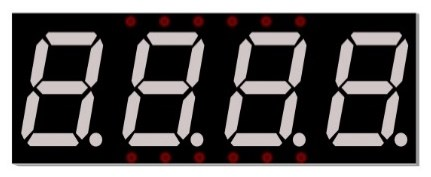

A 7-segment display is an 8-shaped component that packages 7 LEDs. Each of the LEDs in the display is given a positional segment with one of its connection pins led out from the rectangular plastic package. These LED pins are labeled from "a" to "g" representing each individual LED. 

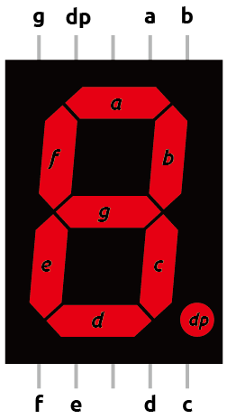

* :ref:`learn_7segment`

A 4-digit display combines four 7-segment displays, each representing a single digit. To reduce the number of pins needed, the segments of each display are multiplexed, meaning each segment pin is connected to all corresponding segment pins of the other displays.

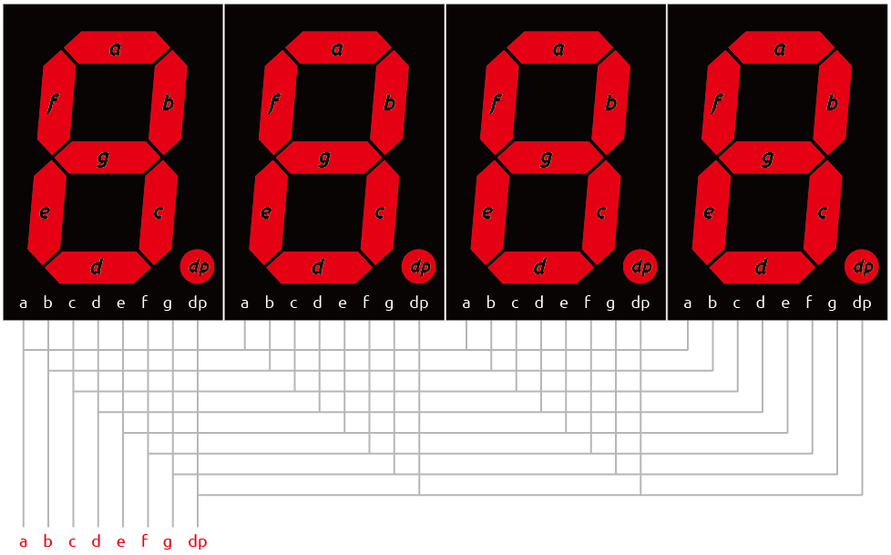

This reduces the pin count but increases the control complexity. For example, applying voltage to the "a" pin lights up the "a" segments of all digits. To control which digit displays the segment, each digit has a separate control pin(d1 ~ d4).

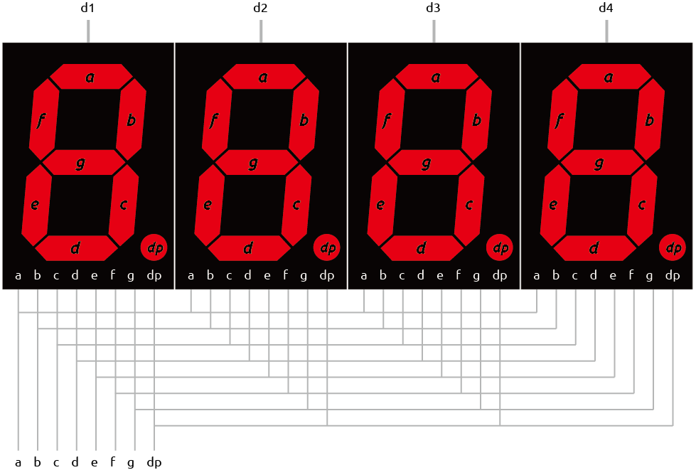

As a result if we want to display the number 2222, we have to apply voltage to the d1, d2, d3 and d4 because all displays will show a digit. We also need to apply voltage to inputs a, b, d, e, g, dp as shown below:

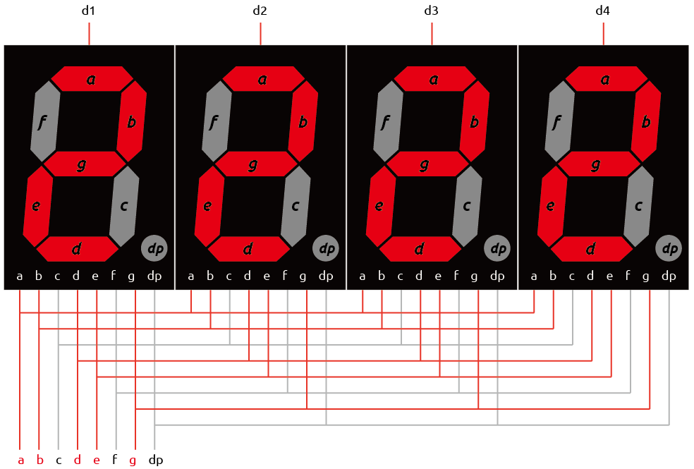

**Pinout**

A typical 4-digit 7-segment display has 12 pins, with six pins on each side.

Four pins (d1, d2, d3, and d4) control the individual digits. The remaining pins correspond to the segments.

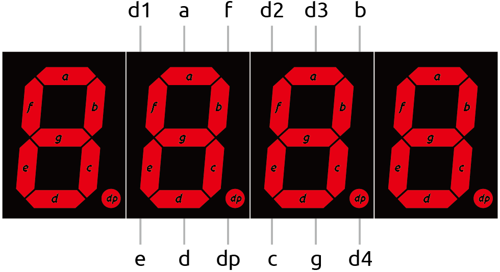

**Common Cathode or Common Anode**

To determine whether a 4-digit 7-segment display is common cathode or common anode, you can use a multimeter. You can also use a multimeter to test if each segment of the display is working properly, as follows:

1. Set the multimeter to diode test mode. The diode test is a function of the multimeter used to check the forward conduction of diodes or similar semiconductor devices (such as LEDs). The multimeter passes a small current through the diode. If the diode is intact, it will allow the current to pass.

.. image:: img/multimeter_diode.png
    :width: 300
    :align: center

2. Insert the 4-digit 7-segment display into a breadboard. Insert a wire in the same row as pin **d1** of the display, and touch it with the black lead of the multimeter. Insert another wire in the same row as pin **e** of the display, and touch it with the red lead.

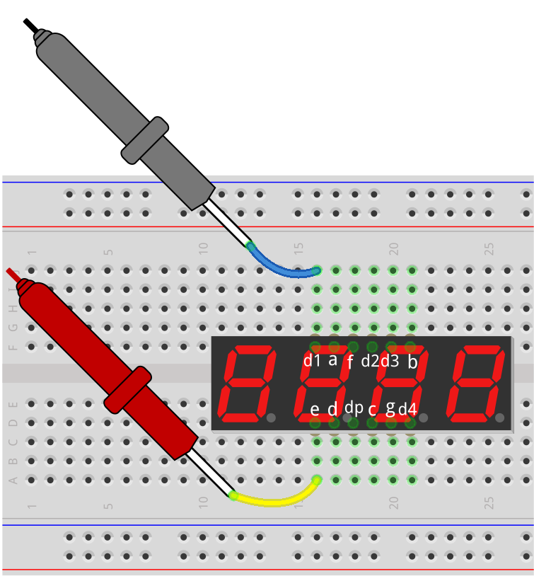

3. Observe whether any LED segment lights up. If so, it indicates that the display is common cathode. If not, swap the red and black leads; if a segment lights up after swapping, it indicates that the display is common anode.

.. note::

  Our kit includes a common cathode 4-digit 7-segment display. Set control pins d1-d4 to LOW and segment pins a-g to HIGH to make it work.

**Question**

If you want the leftmost digit (d1) of the 4-digit 7-segment display to show "2", what should be the levels of d1~d4 and a~g pins?

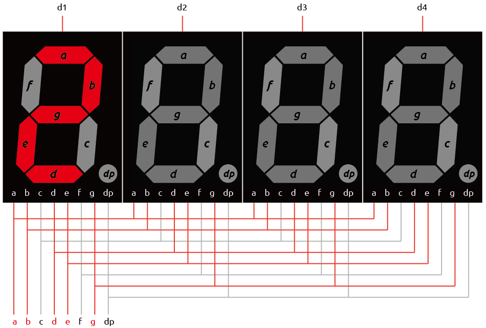

.. list-table::
    :widths: 20 20 20 20
    :header-rows: 1

    *   - 7-segment Display
        - HIGH or LOW
        - 7-segment Display
        - HIGH or LOW
    *   - d1
        - 
        - a
        -  
    *   - d2
        - 
        - b
        - 
    *   - d3
        - 
        - c
        -   
    *   - d4
        - 
        - d
        - 
    *   - 
        - 
        - e
        - 
    *   - 
        - 
        - f
        - 
    *   - 
        - 
        - g
        - 
    *   - 
        - 
        - dp
        - 

Build the Circuit
------------------------------------

**Components Needed**

.. list-table:: 
   :widths: 25 25 25 25
   :header-rows: 0

   * - 1 * Arduino Uno R3
     - 1 * 4-digit 7-segment Display
     - 4 * 220Ω Resistor
     - 1 * Multimeter
   * - |list_uno_r3|
     - |list_4digit| 
     - |list_220ohm|
     - |list_meter|
   * - 1 * USB Cable
     - 1 * Breadboard
     - 
     -   
   * - |list_usb_cable| 
     - |list_breadboard| 
     - 
     - 
    
**Building Steps**

Follow the wiring diagram, or the steps below to build your circuit.

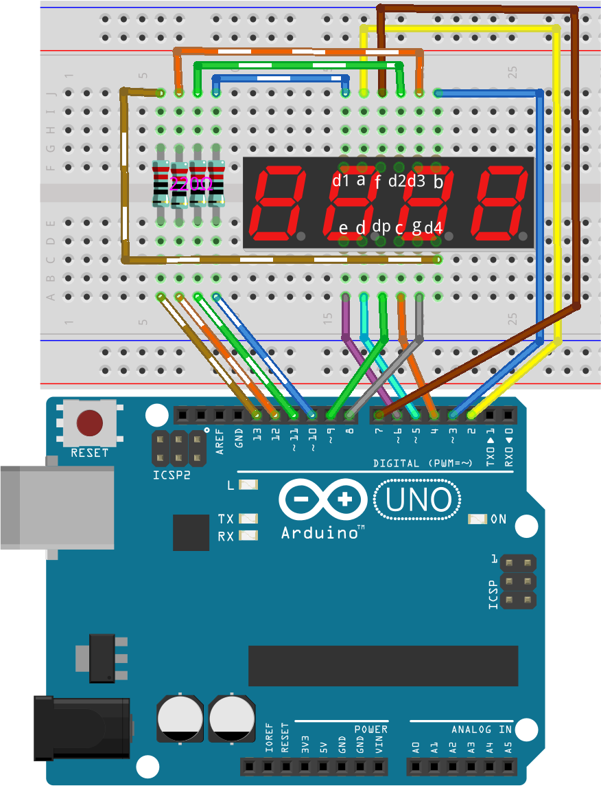

1. Insert the 4-digit 7-segment display into the breadboard.

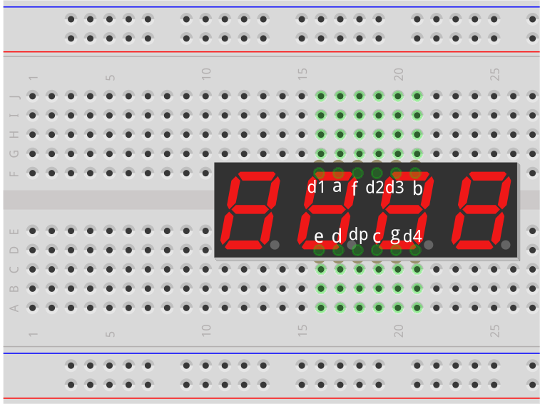

2. Insert four 220Ω resistors into the breadboard.

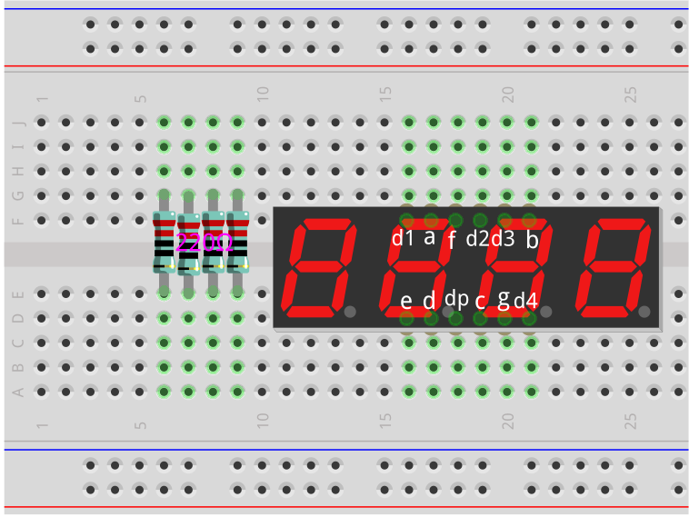

3. Connect the control pin d1 to one side of the first resistor. Connect the other side of the resistor to pin 10 of the Arduino Uno R3. This connects the control pin d1 to pin 10 through the resistor.

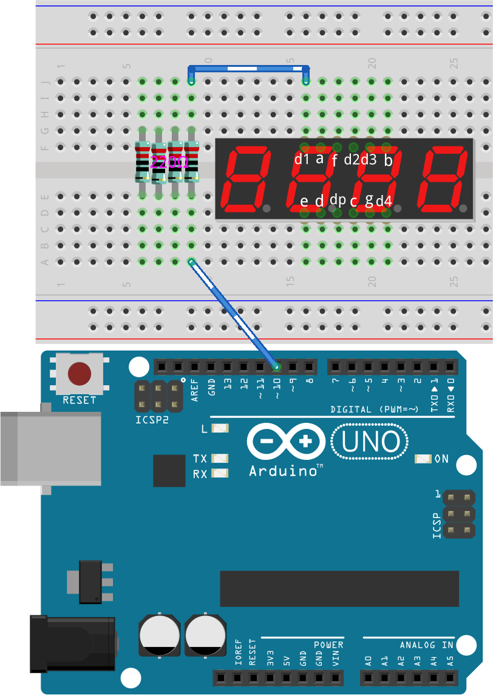

4. Similarly, connect d2 to pin 11, d3 to pin 12, and d4 to pin 13.

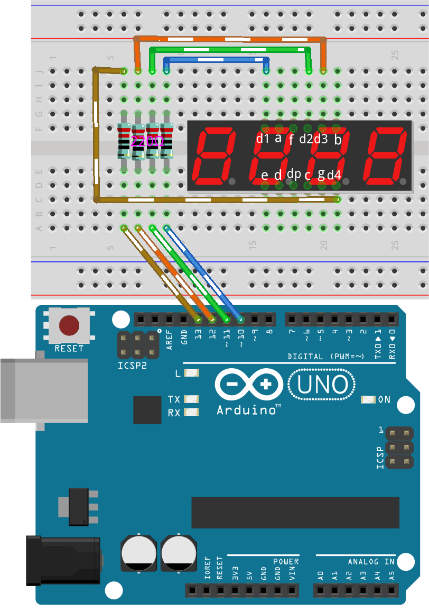
  
5. Now, connect the adp pins to pins 2~9 of the Arduino according to the wiring table.

.. list-table::
    :widths: 20 20
    :header-rows: 1

    *   - 7-segment Display
        - Arduino Uno R3
    *   - a
        - 2
    *   - b
        - 3 
    *   - c
        - 4
    *   - d
        - 5
    *   - e
        - 6
    *   - f
        - 7
    *   - g
        - 8
    *   - dp
        - 9

Code Creation - Displaying 2 on One Digit
--------------------------------------------------

Now let's write code to display a number on one digit of the 4-digit 7-segment display.

1. Open the Arduino IDE and start a new project by selecting “New Sketch” from the “File” menu.
2. Save your sketch as ``Lesson32_Show_2_One_Digit`` using ``Ctrl + S`` or by clicking “Save”.

3. First, create two arrays to store the segment and digit pins of the 4-digit 7-segment display.

.. code-block:: Arduino

  // Define the pins of the segments and the digits on the 4-digit 7-segment display
  int segmentPins[] = { 2, 3, 4, 5, 6, 7, 8, 9 };  // Segments a~g and dp (decimal point)
  int digitPins[] = { 10, 11, 12, 13 };            // Digits d1-d4

4. In the ``void setup()`` function, set all pins as outputs. Since this is a common cathode 4-digit 7-segment display, set all segment pins to ``LOW`` and all digit pins to ``HIGH`` to initially turn off the display.

.. code-block:: Arduino

  void setup() {
    // Set all segment pins as output
    for (int i = 0; i < 8; i++) {
      pinMode(segmentPins[i], OUTPUT);
      digitalWrite(segmentPins[i], LOW);  // Ensure all segments are off initially
    }

    // Set all digit pins as output and turn them off (common cathode, so HIGH is off)
    for (int i = 0; i < 4; i++) {
      pinMode(digitPins[i], OUTPUT);
      digitalWrite(digitPins[i], HIGH);
    }
  }

5. In the ``loop()`` function, to activate the first digit on the left (d1), set its state to ``LOW``. If you want to activate the first digit on the right (d4), change ``0`` to ``3``.

.. code-block:: Arduino

  void loop() {
    digitalWrite(digitPins[0], LOW);     // Turn on first digit
  }

6. To display a number, like 2, you need to set segments a, b, d, e, and g to HIGH. This will display the number 2.

.. code-block:: Arduino
  :emphasize-lines: 4-8

  void loop() {
    digitalWrite(digitPins[1], LOW);     // Turn on first digit
    
    digitalWrite(segmentPins[0], HIGH);  //Turn on segment a
    digitalWrite(segmentPins[1], HIGH);  //Turn on segment b
    digitalWrite(segmentPins[3], HIGH);  //Turn on segment d
    digitalWrite(segmentPins[4], HIGH);  //Turn on segment e
    digitalWrite(segmentPins[6], HIGH);  //Turn on segment g
  }

7. Upload the code to the Arduino Uno R3 board, and you should see the first digit on the left display 2.

.. code-block:: Arduino

  // Define the pins of the segments and the digits on the 4-digit 7-segment display
  int segmentPins[] = { 2, 3, 4, 5, 6, 7, 8, 9 };  // Segments a~g and dp (decimal point)
  int digitPins[] = { 10, 11, 12, 13 };            // Digits d1-d4

  void setup() {
    // Set all segment pins as output
    for (int i = 0; i < 8; i++) {
      pinMode(segmentPins[i], OUTPUT);
      digitalWrite(segmentPins[i], LOW);  // Ensure all segments are off initially
    }

    // Set all digit pins as output and turn them off (common cathode, so HIGH is off)
    for (int i = 0; i < 4; i++) {
      pinMode(digitPins[i], OUTPUT);
      digitalWrite(digitPins[i], HIGH);
    }
  }

  void loop() {
    digitalWrite(digitPins[1], LOW);     // Turn on first digit
    
    digitalWrite(segmentPins[0], HIGH);  //Turn on segment a
    digitalWrite(segmentPins[1], HIGH);  //Turn on segment b
    digitalWrite(segmentPins[3], HIGH);  //Turn on segment d
    digitalWrite(segmentPins[4], HIGH);  //Turn on segment e
    digitalWrite(segmentPins[6], HIGH);  //Turn on segment g
  }

Code Creation - Scrolling Numbers on One Digit
-------------------------------------------------
In the previous project, we learned how to display a single number like 2 on one digit. But what if we want to scroll through numbers 0~9? Using the same method would be very lengthy.

In Lesson 28, we learned the binary, decimal, and hexadecimal codes for the numbers 0-9 on a common cathode display.

.. list-table::
    :widths: 20 40 30 30
    :header-rows: 1

    *   - Number
        - Binary
        - Decimal
        - Hexadecimal
    *   - 0
        - B00111111
        - 63
        - 0x3F
    *   - 1
        - B00000110
        - 6
        - 0x06
    *   - 2
        - B01011011
        - 91
        - 0x5B
    *   - 3
        - B01001111
        - 79
        - 0x4F
    *   - 4
        - B01100110
        - 102
        - 0x66
    *   - 5
        - B01101101
        - 109
        - 0x6D
    *   - 6
        - B01111101
        - 125
        - 0x7D
    *   - 7
        - B00000111
        - 7
        - 0x07
    *   - 8
        - B01111111
        - 127
        - 0x7F
    *   - 9
        - B01101111
        - 111
        - 0x6F

Here's how to use this to scroll through numbers 0~9 on one digit.

1. Open the sketch you saved earlier, ``Lesson32_Show_2_One_Digit``. Hit “Save As...” from the “File” menu, and rename it to ``Lesson32_Scroll_Numbers_One_Digit``. Click "Save".

2. Store the binary codes for numbers 0~9 in the array ``numArray[]``.

.. code-block:: Arduino
  :emphasize-lines: 6

  // Define the pins of the segments and the digits on the 4-digit 7-segment display
  int segmentPins[] = { 2, 3, 4, 5, 6, 7, 8, 9 };  // Segments a~g and dp (decimal point)
  int digitPins[] = { 10, 11, 12, 13 };            // Digits d1-d4

  //display 0,1,2,3,4,5,6,7,8,9
  int numArray[] = { B00111111, B00000110, B01011011, B01001111, B01100110, B01101101, B01111101, B00000111, B01111111, B01101111 };

3. Now, create a function to display the selected number on the chosen digit.

.. code-block:: Arduino

  void displayNumberOnDigit(int number, int digit) {
    // Turn off all digits to prevent ghosting when switching numbers
    for (int i = 0; i < 4; i++) {
      // Turn off digit (common cathode -> HIGH is off)
      digitalWrite(digitPins[i], HIGH);
    }

    // Set the segments for the current number
    int value = numArray[number];
    for (int i = 0; i < 8; i++) {
      digitalWrite(segmentPins[i], (value >> i) & 1);  // Set each segment
    }

    // Turn on the selected digit (common cathode -> LOW is on)
    digitalWrite(digitPins[digit], LOW);
  }

* Turns off all digits to prevent ghosting, especially when changing the displayed number.

.. code-block:: Arduino
  
    // Turn off all digits to prevent ghosting when switching numbers
    for (int i = 0; i < 4; i++) {
      // Turn off digit (common cathode -> HIGH is off)
      digitalWrite(digitPins[i], HIGH);
    }

* Uses a bitwise operation to determine which segments to light up for each number. 
  
  .. code-block:: Arduino
    :emphasize-lines: 4
    
    // Set the segments for the current number
    int value = numArray[number];
    for (int i = 0; i < 8; i++) {
      digitalWrite(segmentPins[i], (value >> i) & 1);  // Set each segment
    }
  
  * Here, the element from the array ``numArray[]`` is assigned to the variable ``value``. If ``number`` is 2, the third element (``B01011011``) from ``numArray[]`` is assigned to ``value``.
  * Then, a ``for`` loop writes each of the 8 bits of ``B01011011`` (excluding the B) to the array ``segmentPins[i]`` using ``digitalWrite()``. This means segments a, b, d, e, and g are set to 1, and c, f, and dp are set to 0, displaying the number 2.
  * ``&`` is the ``AND`` operator, which performs a bitwise ``AND`` operation on the numbers. ``1&1`` equals 1, ``1&0`` equals 0.

  .. image:: img/32_stopwatch_and.png
    :width: 300
    :align: center
  
  * ``>>`` is the right shift operator, which shifts the bits of the number to the right by the specified number of positions. For example, if ``i`` is 1, ``B01011011`` shifts right by one bit, dropping the rightmost bit and adding a 0 on the left. If ``i`` is 2, ``B01011011`` shifts right by two bits, dropping the two rightmost bits and adding two 0s on the left.
  * The result of the right shift is then performed a bitwise AND with 1 to get either 1 or 0.

  .. image:: img/32_stopwatch_shift_right.png
    :width: 500
    :align: center

* Activates only the digit where the number should be displayed.

.. code-block:: Arduino
  
    // Turn on the selected digit (common cathode -> LOW is on)
    digitalWrite(digitPins[digit], LOW);

4. In the ``void loop`` main program, use a ``for`` loop to make the first digit on the left scroll through numbers 0 to 9.

.. code-block:: Arduino
  :emphasize-lines: 4

  void loop() {
    // Display numbers 0 to 9 sequentially on the first digit (D1)
    for (int num = 0; num < 10; num++) {
      displayNumberOnDigit(num, 0);  // Display the number on digit 1 (index 0)
      delay(1000);                   // Display each number for 1 second
    }
  }

5. The complete code is shown below. You can upload it to the Arduino Uno R3, and you will see the first digit on the left scroll through numbers 0 to 9.

.. code-block:: Arduino

  // Define the pins of the segments and the digits on the 4-digit 7-segment display
  int segmentPins[] = { 2, 3, 4, 5, 6, 7, 8, 9 };  // Segments A-G and DP (decimal point)
  int digitPins[] = { 10, 11, 12, 13 };            // Digits D1-D4

  //display 0,1,2,3,4,5,6,7,8,9
  int numArray[] = { B00111111, B00000110, B01011011, B01001111, B01100110, B01101101, B01111101, B00000111, B01111111, B01101111 };

  void setup() {
    // Set all segment pins as output
    for (int i = 0; i < 8; i++) {
      pinMode(segmentPins[i], OUTPUT);
      digitalWrite(segmentPins[i], LOW);  // Ensure all segments are off initially
    }

    // Set all digit pins as output and turn them off (common cathode, so HIGH is off)
    for (int i = 0; i < 4; i++) {
      pinMode(digitPins[i], OUTPUT);
      digitalWrite(digitPins[i], HIGH);
    }
  }

  void loop() {
    // Display numbers 0 to 9 sequentially on the first digit (D1)
    for (int num = 0; num < 10; num++) {
      displayNumberOnDigit(num, 0);  // Display the number on digit 1 (index 0)
      delay(1000);                   // Display each number for 1 second
    }
  }

  void displayNumberOnDigit(int number, int digit) {
    // Turn off all digits to prevent ghosting when switching numbers
    for (int i = 0; i < 4; i++) {
      // Turn off digit (common cathode -> HIGH is off)
      digitalWrite(digitPins[i], HIGH);
    }

    // Set the segments for the current number
    int value = numArray[number];
    for (int i = 0; i < 8; i++) {
      digitalWrite(segmentPins[i], (value >> i) & 1);  // Set each segment
    }

    // Turn on the selected digit (common cathode -> LOW is on)
    digitalWrite(digitPins[digit], LOW);
  }

**Question**

In programming, bitwise operations like ``AND`` and ``OR`` are crucial for manipulating individual bits of data. The bitwise ``AND`` operation (&), compares each bit of its operands, resulting in 1 if both bits are 1, and 0 otherwise. Conversely, the bitwise ``OR`` operation (``|``), results in 1 if at least one of the bits is 1, and 0 only if both bits are 0. 

Given this information, consider the expression ``(B01011011 >> 2) | 1``. After right-shifting the binary number ``B01011011`` by 2 positions, what is the result of applying the bitwise OR with 1?

Code Creation - Stopwatch
-----------------------------

Previously, we learned how to display a single digit and scroll through numbers on one digit. Now, let's learn how to use the 4-digit 7-segment display to create a stopwatch.

* To create a stopwatch, you need the left two digits to display minutes and the right two digits to display seconds.
* When the seconds count reaches 59, it resets to 0, and the minute count increases by 1.
* When the minute count reaches 99, it resets to 0.

1. Open the sketch you saved earlier, ``Lesson32_Show_2_One_Digit``. Hit “Save As...” from the “File” menu, and rename it to ``Lesson32_Stopwatch``. Click "Save".

2. Now create 3 variables to store time components, ``previousMillis`` is used to keep track of time since the last update, ``seconds`` and ``minutes`` store the stopwatch time.

.. code-block:: Arduino
  :emphasize-lines: 9-11

  // Define the pins of the segments and the digits on the 4-digit 7-segment display
  int segmentPins[] = {2, 3, 4, 5, 6, 7, 8, 9};  // Segments A-G and DP (decimal point)
  int digitPins[] = {10, 11, 12, 13};            // Digits D1-D4

  //display 0,1,2,3,4,5,6,7,8,9
  int numArray[] = { B00111111, B00000110, B01011011, B01001111, B01100110, B01101101, B01111101, B00000111, B01111111, B01101111 };

  // Variables to store time components
  unsigned long previousMillis = 0;  // Stores the last time the display was updated
  int seconds = 0;  // Stores the second count
  int minutes = 0;  // Stores the minute count

3. In the ``void loop()`` function:

* Use ``millis()`` function to return the number of milliseconds since the Arduino board began running the current program.
* Then increment the seconds once every 1000 milliseconds (one second). When seconds reach 60, it resets to 0 and increments minutes. If minutes reach 100, it resets to 0, thereby starting the count again.
* ``updateDisplay()`` is called within each loop iteration to actively multiplex the display based on the current seconds and minutes.

.. code-block:: Arduino

  void loop() {
    unsigned long currentMillis = millis();        // Get the current time in milliseconds
    if (currentMillis - previousMillis >= 1000) {  // Check if a second has passed
      previousMillis = currentMillis;              // Reset the timer
      seconds++;                                   // Increment the seconds
      if (seconds >= 60) {                         // Check if 60 seconds have passed
        seconds = 0;                               // Reset seconds
        minutes++;                                 // Increment the minutes
        if (minutes > 99) {                        // Check if 100 minutes have passed
          minutes = 0;                             // Reset minutes
        }
      }
    }
    updateDisplay();  // Update the display to show the current time
  }

4. About ``updateDisplay()`` function: Instead of setting the display once per second, ``updateDisplay()`` is called continuously in the main loop. It cycles through each digit, turning it on for a short duration with the correct segments lit, then turns it off again. This process repeats quickly to give the appearance of a stable display.

.. code-block:: Arduino

  void updateDisplay() {
    for (int digit = 0; digit < 4; digit++) {
      setDigitValues(minutes, seconds, digit);
      digitalWrite(digitPins[digit], LOW); // Turn on current digit
      delay(5); // Delay to keep the digit visible
      digitalWrite(digitPins[digit], HIGH); // Turn off digit
    }
  }

5. About ``setDigitValues()`` function: ``setDigitValues()`` takes care of setting the segments for each digit based on the current time (minutes and seconds). This function is called each time a digit is activated to ensure it shows the correct value.

.. code-block:: Arduino

  void setDigitValues(int mins, int secs, int digit) {
    int values[] = {
      mins / 10, // tens of minutes
      mins % 10, // ones of minutes
      secs / 10, // tens of seconds
      secs % 10  // ones of seconds
    };

    int value = numArray[values[digit]];

    for (int segment = 0; segment < 8; segment++) {
      digitalWrite(segmentPins[segment], (value >> segment) & 1);
    }
  }

6. Your complete code is shown below. You can now upload it to the Arduino board to see the stopwatch effect on the 4-digit 7-segment display.

.. code-block:: Arduino

  // Define the pins of the segments and the digits on the 4-digit 7-segment display
  int segmentPins[] = { 2, 3, 4, 5, 6, 7, 8, 9 };  // Segments A-G and DP (decimal point)
  int digitPins[] = { 10, 11, 12, 13 };            // Digits D1-D4

  //display 0,1,2,3,4,5,6,7,8,9
  int numArray[] = { B00111111, B00000110, B01011011, B01001111, B01100110, B01101101, B01111101, B00000111, B01111111, B01101111 };

  // Variables to store time components
  unsigned long previousMillis = 0;  // Stores the last time the display was updated
  int seconds = 0;                   // Stores the second count
  int minutes = 0;                   // Stores the minute count

  void setup() {
    // Set all segment pins as output
    for (int i = 0; i < 8; i++) {
      pinMode(segmentPins[i], OUTPUT);
      digitalWrite(segmentPins[i], LOW);  // Ensure all segments are off initially
    }

    // Set all digit pins as output and turn them off (common cathode, so HIGH is off)
    for (int i = 0; i < 4; i++) {
      pinMode(digitPins[i], OUTPUT);
      digitalWrite(digitPins[i], HIGH);
    }
  }

  void loop() {
    unsigned long currentMillis = millis();        // Get the current time in milliseconds
    if (currentMillis - previousMillis >= 1000) {  // Check if a second has passed
      previousMillis = currentMillis;              // Reset the timer
      seconds++;                                   // Increment the seconds
      if (seconds >= 60) {                         // Check if 60 seconds have passed
        seconds = 0;                               // Reset seconds
        minutes++;                                 // Increment the minutes
        if (minutes > 99) {                        // Check if 100 minutes have passed
          minutes = 0;                             // Reset minutes
        }
      }
    }
    updateDisplay();  // Update the display to show the current time
  }

  void updateDisplay() {
    for (int digit = 0; digit < 4; digit++) {
      setDigitValues(minutes, seconds, digit);
      digitalWrite(digitPins[digit], LOW);   // Turn on current digit
      delay(5);                              // Delay to keep the digit visible
      digitalWrite(digitPins[digit], HIGH);  // Turn off digit
    }
  }

  void setDigitValues(int mins, int secs, int digit) {
    int values[] = {
      mins / 10,  // tens of minutes
      mins % 10,  // ones of minutes
      secs / 10,  // tens of seconds
      secs % 10   // ones of seconds
    };

    int value = numArray[values[digit]];

    for (int segment = 0; segment < 8; segment++) {
      digitalWrite(segmentPins[segment], (value >> segment) & 1);
    }
  }

7. Finally, remember to save your code and tidy up your workspace.

**Summary**

In this lesson, we explored the functionality of the 4-digit 7-segment display and learned how to control it using an Arduino. We started by displaying a single number on one digit and then progressed to scrolling through numbers. Finally, we combined these skills to create a simple stopwatch that displays minutes and seconds. This project not only taught us about digital displays but also enhanced our programming skills with Arduino. Well done on completing this lesson, and keep experimenting to create even more amazing projects!