.. note::

    Hallo und herzlich willkommen in der SunFounder Raspberry Pi & Arduino & ESP32 Enthusiasten-Community auf Facebook! Tauchen Sie gemeinsam mit anderen Enthusiasten tiefer in die Welt von Raspberry Pi, Arduino und ESP32 ein.

    **Warum beitreten?**

    - **Expertenunterstützung**: Lösen Sie nach dem Kauf auftretende Probleme und technische Herausforderungen mit Hilfe unserer Community und unseres Teams.
    - **Lernen & Teilen**: Tauschen Sie Tipps und Tutorials aus, um Ihre Fähigkeiten zu verbessern.
    - **Exklusive Vorschauen**: Erhalten Sie frühzeitigen Zugang zu neuen Produktankündigungen und ersten Einblicken.
    - **Spezielle Rabatte**: Genießen Sie exklusive Rabatte auf unsere neuesten Produkte.
    - **Festliche Aktionen und Verlosungen**: Nehmen Sie an Verlosungen und Sonderaktionen während der Feiertage teil.

    👉 Bereit, mit uns zu entdecken und zu kreieren? Klicken Sie auf [|link_sf_facebook|] und treten Sie noch heute bei!

3. Messen mit dem Multimeter
==========================================
Willkommen zu unserer Erkundung des Multimeters, einem unverzichtbaren Werkzeug in der Elektronik. Diese Lektion führt Sie durch die Funktionen und Anwendungen des Multimeters und zeigt Ihnen, wie Sie verschiedene elektrische Größen effektiv messen können. Angefangen bei den Grundlagen, wie dem Einrichten des Multimeters mit Batterie und Messleitungen, werden wir uns mit der Anpassung der Einstellungen und der Nutzung seiner zahlreichen Funktionen befassen. Diese praktische Erfahrung vermittelt Ihnen nicht nur theoretisches Wissen, sondern befähigt Sie auch, präzise Messungen an jedem Schaltkreis durchzuführen.

Folgendes werden Sie erreichen:

* Verstehen der Komponenten und Funktionen eines Multimeters
* Beherrschen der Messung von Spannung, Strom und Widerstand
* Vertiefung Ihres Verständnisses der elektronischen Grundlagen durch praktische Übungen

Diese Lektion wird nicht nur Ihre technischen Fähigkeiten verbessern, sondern auch praktisches Wissen vermitteln, das eine solide Grundlage für Ihr zukünftiges Elektroniklernen und Ihre Projekte bildet.

Mehr über das Multimeter erfahren
--------------------------------------------

Ein Multimeter ist ein Gerät zur Messung verschiedener elektrischer Größen. Die meisten Multimeter können Spannung, Strom, Widerstand und Durchgang (ob Strom fließen kann) messen.

Das Ziffernblatt des Multimeters ermöglicht die Auswahl der Art der elektrischen Messung und des Bereichs, in dem Sie messen möchten. Schauen wir uns nun die verschiedenen Funktionen des Ziffernblatts an.

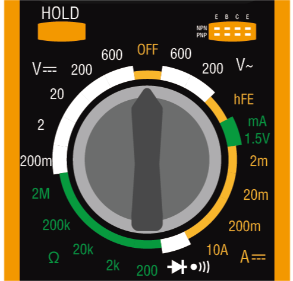

**Gleichspannung (DC)**
 
Auf diesem Bild ist die ausgewählte Position für die Messung der Gleichspannung (DC) zu sehen. Spannung wird durch ein großes V dargestellt. Gleichstrom (DC) wird durch drei gestrichelte Linien mit einer geraden Linie darüber angezeigt.

Ihr Multimeter verfügt über fünf verschiedene Gleichspannungsbereiche – 200m (Millivolt), 2V (Volt), 20V (Volt), 200V (Volt) und 600V (Volt). Diese Zahlen geben die maximale Spannung an, die in jeder Einstellung gemessen werden kann.

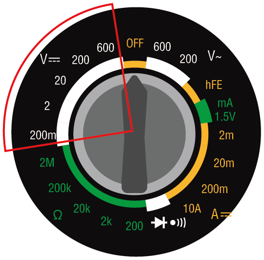

.. note::

    Hier die Umrechnung zwischen Volt:

    * 1 Millivolt (mV) = 0,001 Volt (V)

    Zum Beispiel, wenn Sie eine Spannung von 500 Millivolt (mV) haben, kann dies auch als 0,5 Volt (V) ausgedrückt werden.

**Messmethode**: Vor der Spannungsmessung müssen Sie einen geeigneten Messbereich auswählen. In all unseren Kursen wird die Schaltungsspannung 5V nicht überschreiten, sodass Sie einfach die 20V-Position auswählen können. Wenn die Schaltung ordnungsgemäß funktioniert, können Sie die Spannung testen, indem Sie die roten und schwarzen Messleitungen auf beiden Seiten des Geräts platzieren.

**Wechselspannung (AC)**

Dieses Bild zeigt die Einstellung zur Messung der Wechselspannung (AC). Wechselstrom wird durch eine Wellenlinie dargestellt.

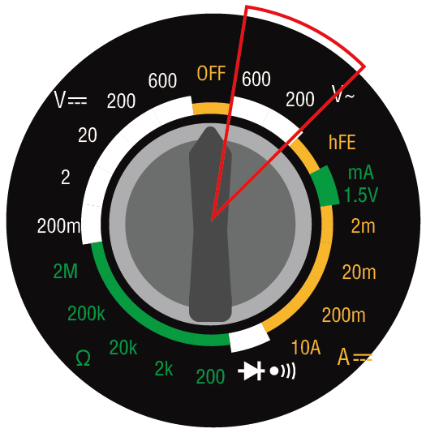

**Transistoren**

Die hFE NPN PNP-Einstellung dient zur Messung von Transistoren. Diese Einstellung wird in diesem Kurs nicht verwendet.

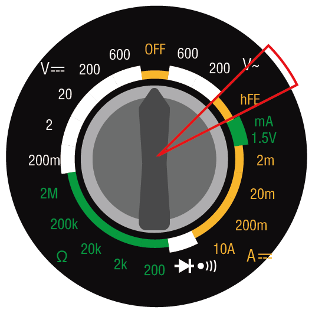

**1.5V mA**

Die "1.5V mA"-Einstellung auf einem Messgerät wird verwendet, um den Strom bei einer Spannung von 1,5V zu messen. Typischerweise wird diese Einstellung verwendet, um zu testen, wie viel Strom eine Schaltung oder ein Gerät bei dieser Spannung zieht.

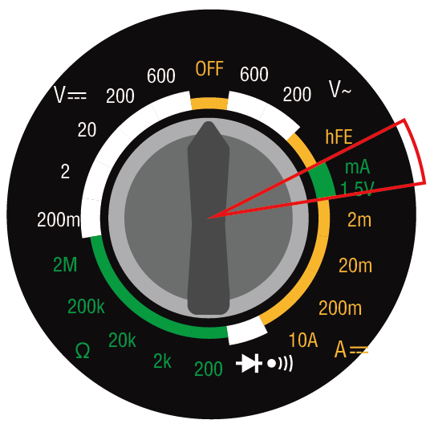

**Stromstärke**

Zur Messung von Strom verfügt das Multimeter über Einstellungen für 2m (2 Milliampere), 20m (20 Milliampere), 200m (200 Milliampere) und 10A (10 Ampere).

.. image:: img/multimeter_current.png
    :width: 300
    :align: center

.. note::

    Hier die Umrechnung zwischen Ampere:

    * 1 Milliampere (mA) = 0,001 Ampere (A)

    Zum Beispiel, wenn Sie einen Strom von 50 Milliampere (mA) haben, kann dies auch als 0,05 Ampere (A) ausgedrückt werden.

Um Ströme unter 200 Milliampere zu messen, können Sie die rote Messleitung in den VΩmA-Anschluss stecken. Drehen Sie dann das Ziffernblatt auf eine der Milliampere-Einstellungen. Die Schaltungen, die Sie in diesem Kurs und Projekt aufbauen, werden immer Ströme unter 200 mA haben.

Um Ströme bis zu 10 Ampere zu messen, müssen Sie die rote Messleitung in den 10ADC-Anschluss stecken. Drehen Sie dann das Ziffernblatt auf die 10A-Einstellung.

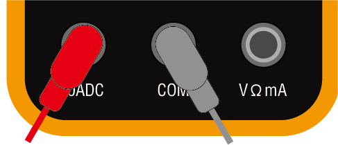

**Messmethode**: Um den Strom in einem Schaltkreis zu messen, muss das Multimeter in den Schaltkreis eingefügt werden. Mit anderen Worten, es muss Teil des Schaltkreises werden. Dies unterscheidet sich von der Messung von Spannung oder Widerstand, die durch das Messen über eine Komponente im Schaltkreis erfolgen kann. Sie werden später die Gelegenheit haben, diese Messungen durchzuführen, wenn Sie anfangen, Schaltungen zu bauen.

**Durchgang**

Die Einstellung mit einem Diodensymbol und einem Tonsymbol wird zur Messung des Durchgangs verwendet. Bei der Messung des Durchgangs gibt das Multimeter ein "Pieps"-Geräusch von sich, wenn zwischen den Messleitungen Strom fließen kann.

.. image:: img/multimeter_diode.png
    :width: 300
    :align: center

**Widerstand**

Die letzte Einstellungsgruppe des Multimeters ist für die Widerstandsmessung vorgesehen, dargestellt durch den griechischen Buchstaben Omega (Ω). Typischerweise bieten Multimeter verschiedene Bereiche für die Widerstandsmessung an. Dieses Multimeter ist mit fünf Bereichen ausgestattet: 200 Ohm, 2k (2.000 Ohm), 20k (20.000 Ohm), 200k (200.000 Ohm) und 2M (2.000.000 Ohm). Jeder Bereich gibt den höchsten Widerstandswert an, den es genau messen kann. Um die genauesten Messungen zu erzielen, wählen Sie einen Bereich, der den Widerstand messen kann, ohne dessen obere Grenze zu überschreiten.

.. image:: img/multimeter_resistance.png
    :width: 300
    :align: center

.. note::

    Hier die Umrechnung zwischen Ohm:

    * 1 Kiloohm (kΩ) = 1000 Ohm (Ω)
    * 1 Megaohm (MΩ) = 1.000.000 Ohm (Ω)

Zum Beispiel, wenn Sie einen Widerstand von 1000 Ohm (Ω) haben, kann dies auch als 1 Kiloohm (kΩ) ausgedrückt werden.

**Tipps**

Während der Messung von Widerstand, Spannung oder Stromstärke stellen Sie möglicherweise fest, dass die Werte auf dem Display variieren. Um einen bestimmten Wert zu stabilisieren und festzuhalten, können Sie die HOLD-Funktion verwenden. Diese friert den aktuellen Wert auf dem Display ein, bis die HOLD-Taste erneut gedrückt wird.

Wenn Sie sich unsicher sind, welchen Bereich Sie für die Messung von Spannung, Stromstärke oder Widerstand wählen sollen, empfiehlt es sich, mit dem maximal verfügbaren Bereich zu beginnen. Dieser Ansatz liefert eine erste Schätzung der Werte, mit denen Sie arbeiten, sodass Sie anschließend auf einen genaueren Bereich umstellen können, um präzise Messungen zu erhalten.

**Frage**

Nachdem Sie nun ein detailliertes Verständnis für die Verwendung eines Multimeters haben, überlegen Sie, welche Multimeter-Einstellung Sie zur Messung der folgenden elektrischen Werte verwenden würden:

.. list-table::
  :widths: 25 25
  :header-rows: 1

  * - Messobjekt
    - Multimeter-Einstellung
  * - 9V Gleichspannung
    -
  * - 1K Ohm
    -
  * - 40 Milliampere
    - 
  * - 110 Volt Wechselspannung
    -

.. _use_multimeter:

Messungen mit einem Multimeter
--------------------------------

In der vorherigen Lektion haben Sie einen einfachen Schaltkreis eingerichtet, um eine LED zum Leuchten zu bringen. Jetzt werden wir ein Multimeter verwenden, um die Spannung, den Strom und den Widerstand in diesem Schaltkreis zu messen. Schauen wir uns an, wie es funktioniert!

**Vorbereitung des Multimeters**

Bevor Sie das Multimeter verwenden, müssen Sie die Batterie einlegen und die beiden Messleitungen anschließen, damit es jederzeit einsatzbereit ist.

1. Folgen Sie dem unten stehenden Video, um die Batterie an Ihr Multimeter anzuschließen.

  .. raw:: html

      <video muted controls style = "max-width:90%">
          <source src="_static/video/3_multimeter_battery.mp4" type="video/mp4">
          Your browser does not support the video tag.
      </video>

2. Finden Sie Ihr Multimeter sowie die roten und schwarzen Messleitungen. Stellen Sie sicher, dass das Multimeter auf "aus" steht. Stecken Sie die schwarze Messleitung in den COM-Anschluss des Multimeters. Stecken Sie die rote Messleitung in den Spannung-Ohm-Milliampere-Anschluss (VΩmA).

.. image:: img/multimeter_test_wire.png
  :width: 300
  :align: center

**Spannungsmessung**

1. Stellen Sie das Multimeter auf die Einstellung für 20 Volt Gleichspannung.

.. image:: img/multimeter_dc_20v.png
  :width: 300
  :align: center

2. Ziehen Sie die positiven und negativen Drähte auf dem Breadboard leicht auseinander, um die Metallenden freizulegen, ohne sie vollständig zu trennen.

3. Berühren Sie dann die freiliegenden Metallenden mit den roten und schwarzen Messleitungen des Multimeters, um die Spannung zu messen.

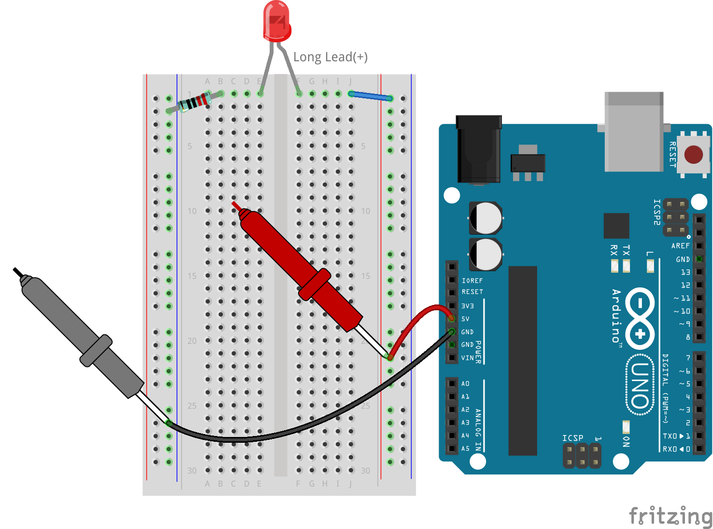

4. Notieren Sie die gemessene Spannung und beobachten Sie die Phänomene in der Spalte "Notizen".

.. note::

    * Meine Spannung betrug 5,13 Volt, tragen Sie Ihren Messwert entsprechend Ihrer Messung ein.

    * Aufgrund von Verdrahtungsproblemen und Instabilität der Hand kann es zu Spannungsschwankungen kommen. Halten Sie Ihre Hand ruhig, beobachten Sie mehrmals, und Sie werden eine relativ stabile Spannungsanzeige erhalten.

.. list-table::
   :widths: 25 25 50 25
   :header-rows: 1

   * - Typ
     - Einheiten
     - Messergebnisse
     - Notizen
   * - Spannung
     - Volt
     - *≈5,13 Volt*
     - 
   * - Stromstärke
     - Milliampere
     - 
     - 
   * - Widerstand
     - Ohm
     - 
     -

5. Stecken Sie abschließend alle Jumperkabel wieder in das Breadboard, um zu verhindern, dass sie während anderer Messungen herausgezogen werden.

**Strommessung**

Sie haben die Spannung im Schaltkreis gemessen. Als nächstes messen Sie den Strom im Schaltkreis.

1. Zur Strommessung muss das Multimeter in den Stromfluss des Schaltkreises integriert werden, wodurch es im Wesentlichen zu einem Teil des leitfähigen Pfades des Schaltkreises wird. Eine einfache Methode besteht darin, die Position der LED anzupassen: Lassen Sie die Anode der LED in Loch 1F und verschieben Sie die Kathode (das kürzere Bein) von Loch 1E auf Loch 3E.

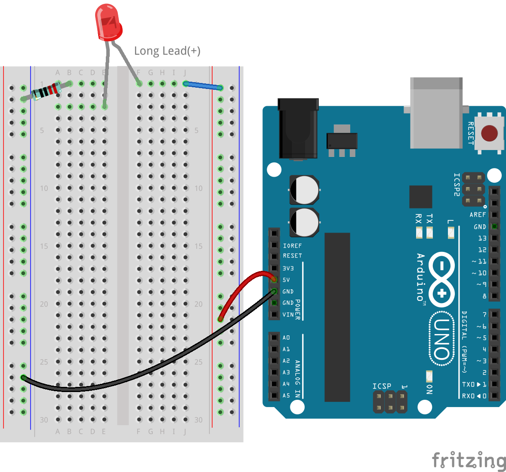

2. Stellen Sie das Multimeter auf die 200 Milliampere-Position ein.

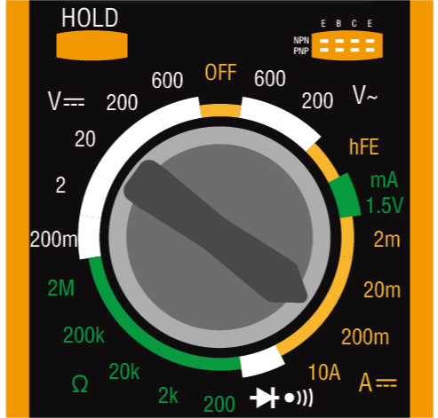

3. Platzieren Sie die schwarze Messleitung auf dem Draht, der mit Loch 1B verbunden ist, und die rote Messleitung an der Kathode der LED in Loch 3E. Sobald die Verbindung hergestellt ist, sollte die rote LED anfangen zu blinken.

  .. note::

    Bei der Spannungsmessung über dem Widerstand und der LED kann es schwierig sein, mit den Messleitungen des Multimeters eine feste Verbindung herzustellen. Um einen besseren Halt zu erzielen, befestigen Sie die Messleitungen dort, wo die Beinchen der Bauteile in das Breadboard gesteckt werden. Auf diese Weise können Sie fester drücken, ohne etwas zu verschieben.

.. image:: img/3_measure_current2.png

4. Sie werden feststellen, dass der gemessene Strom unter 20 mA liegt. Daher können wir auf die 20mA-Position wechseln, um eine genauere Messung zu erhalten.

.. image:: img/multimeter_20a.png
  :width: 300
  :align: center

5. Messen und notieren Sie den Strom im Schaltkreis in Milliampere.

.. note::

  Bitte beachten Sie, dass Schwankungen im gemessenen Strom aufgrund verschiedener Faktoren wie Kontaktstabilität, Versorgungsschwankungen und Temperatureffekte normal sind. Wir empfehlen, einfach den Stromwert zu notieren, den Sie zu einem bestimmten Zeitpunkt messen. Wenn der Wert den theoretischen Erwartungen entspricht, sollte er als akzeptabel angesehen werden.

  
.. list-table::
   :widths: 25 25 50 25
   :header-rows: 1

   * - Typ
     - Einheiten
     - Messergebnisse
     - Notizen
   * - Spannung
     - Volt
     - *≈5,13 Volt*
     - 
   * - Stromstärke
     - Milliampere
     - *≈13,54 Milliampere*
     - 
   * - Widerstand
     - Ohm
     - 
     -

6. Setzen Sie die LED wieder in ihre ursprüngliche Position zurück, mit der Anode in Loch 1F und der Kathode in Loch 1E.

**Berechnung des Gesamtwiderstands**

Das Messen des Widerstands in einem Schaltkreis mit einem Multimeter wird knifflig, wenn LEDs beteiligt sind, da LEDs eine bestimmte Spannung benötigen, um zu leuchten, die sogenannte Vorwärtsspannung. Wenn die Spannung nicht hoch genug ist, leuchtet die LED nicht, und der Stromkreis bleibt offen, was das Messen des Widerstands erschwert. Darüber hinaus darf beim Messen des Widerstands keine andere Spannung im Schaltkreis vorhanden sein als die, die vom Multimeter kommt.

Das direkte Messen des Widerstands im Schaltkreis mit einem Multimeter ist daher nicht einfach. Was sollten wir also tun?

Hier verwenden wir die unten gezeigte Formel, um den Widerstand aus Spannung und Strom zu berechnen, bekannt als Ohmsches Gesetz. Eine detaillierte Einführung dazu erfolgt in der nächsten Lektion.

.. code-block::

    Spannung = Strom x Widerstand

    Oder

    V = I • R

Umgestellt lautet die Gleichung:

.. code-block::

    Widerstand = Spannung / Strom

    Oder

    R = V / I

Mithilfe der obigen Formel und der von Ihnen gemessenen Spannung und Stromstärke können Sie den Gesamtwiderstand im Schaltkreis berechnen und in die Tabelle eintragen.

.. note::

    Spannung wird in Volt, Widerstand in Ohm und Stromstärke in der Tabelle in Milliampere angegeben. Sie müssen Milliampere in Ampere umrechnen:

    1 Ampere = 1000 Milliampere

    Das bedeutet, dass Sie die gemessene Stromstärke durch 1000 teilen müssen, bevor Sie die Formel zur Berechnung des Gesamtwiderstands verwenden. Das Endergebnis der Berechnung ist möglicherweise keine ganze Zahl, runden Sie es daher auf zwei Dezimalstellen. Mein berechneter Wert ist zum Beispiel 378,8774002954, was ich auf 378,88 aufrunde.

    R = 5,13 / (13,54 / 1000) = 378,88 Ohm

.. list-table::
   :widths: 25 25 50 25
   :header-rows: 1

   * - Typ
     - Einheiten
     - Messergebnisse
     - Notizen
   * - Spannung
     - Volt
     - *≈5,13 Volt*
     - 
   * - Stromstärke
     - Milliampere
     - *≈13,54 Milliampere*
     - 
   * - Widerstand
     - Ohm
     - *≈378,88 Ohm*
     -

**Messen des Widerstandswerts**

Nachdem wir nun den Gesamtwiderstand im Schaltkreis berechnet haben, ist es an der Zeit zu sehen, wie viel davon auf den Widerstand und wie viel auf die LED zurückzuführen ist. Unser Widerstand ist mit 220 Ohm markiert, aber mit einer Toleranz von 5% könnte er tatsächlich zwischen 209 und 231 Ohm liegen. Verwenden wir das Multimeter, um seinen genauen Wert zu ermitteln.

1. Beim Messen des Widerstands muss Ihr Multimeter die einzige Spannungsquelle sein; stellen Sie sicher, dass keine anderen Stromquellen an den Schaltkreis angeschlossen sind. Ziehen Sie also alle Jumperkabel vom Arduino Uno R3 ab, um sicherzustellen, dass das Breadboard isoliert ist.

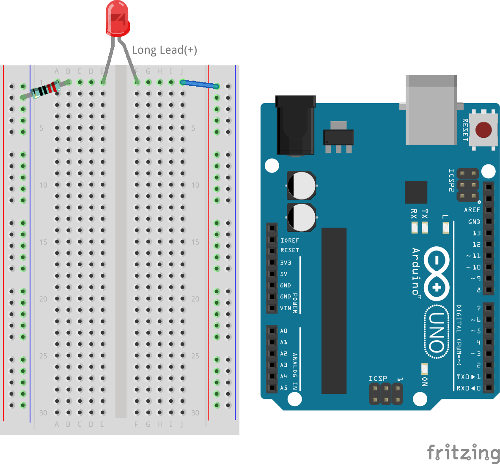

2. Um den Widerstand des Widerstands genau zu messen, stellen Sie Ihr Multimeter auf den 2K (2000 Ohm) Widerstandsmodus ein.

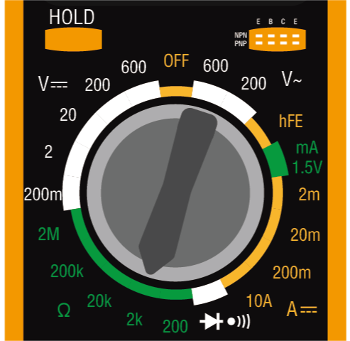

3. Platzieren Sie die roten und schwarzen Messleitungen des Multimeters auf beiden Seiten des Widerstands und notieren Sie den Messwert des Multimeters.

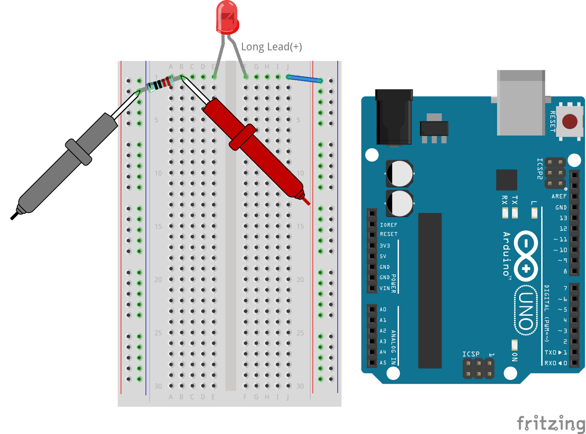

4. Nach dem Messen denken Sie daran, das Multimeter auszuschalten, indem Sie es auf "OFF" stellen.

**Berechnung des Widerstands der LED**

Um den Widerstand der LED zu bestimmen, subtrahieren Sie den Widerstand des Widerstands vom Gesamtwiderstand im Schaltkreis.

.. code-block::

    LED-Widerstand = Gesamtwiderstand - Widerstand des Widerstands

Laut meinen Messungen sollte der Widerstand der LED etwa 163,88 Ohm betragen: 378,88 - 215 = 163,88 Ohm.

Wir haben eine praktische Reise durch die Grundlagen der Verwendung eines Multimeters zur Messung von Spannung, Strom und Widerstand in einem Schaltkreis unternommen. Vom Aufbau eines einfachen LED-Schaltkreises bis hin zur Untersuchung der Feinheiten der Widerstandsmessung in Schaltkreisen mit LEDs haben wir gelernt, wie das Ohmsche Gesetz praktisch angewendet wird und wie die Dynamik von Serienschaltungen und Parallelschaltungen funktioniert. Denken Sie daran, dass diese grundlegenden Fähigkeiten das Fundament für komplexere Projekte und ein tieferes Verständnis der Elektronik bilden. Bleiben Sie neugierig, bleiben Sie experimentierfreudig, und lassen Sie uns gemeinsam den Weg der elektronischen Entdeckungen weitergehen.

